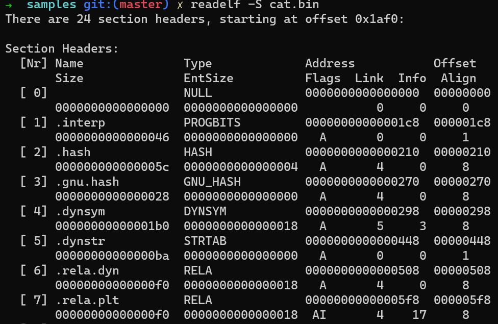
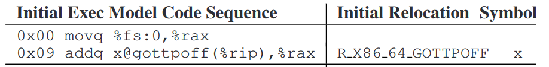

# A Guide to Linking and Loading ELF Files

[TOC]

## a story of --enable-pie

* 几个月前，笔者在给一个内部项目添加在cygwin工具链上进行编译的支持时，遇到了一个奇怪的问题。在不改变代码的情况下，通过cygwin工具链编译出的程序不能正常运行；而使用我们原有的docker中的gcc工具链编出的程序就可以正常运行。具体表现是通过cygwin工具链编译出的程序的控制流会跳转到`0x0`，进而产生无法处理的page fault。笔者基于当时对ELF文件格式（两个工具链都是编译成ELF可执行文件，只是cygwin工具链可以在Windows下运行）的认识，检查了一下两个工具链编译产物的地址空间布局，发现二者有很大的差异。

* 在不同的工具链下，同样是动态链接的app，其内存布局却截然不同。cygwin下编译出来的app，它的代码段必须被加载到虚拟地址`0x400000`。而docker工具链中编译的app，它的代码段的加载地址就等于代码段在文件中的offset，这就说明它和动态库类似，可以被加载到内存中的任意位置。
* 这实际上是因为，cygwin工具链编译出的是位置相关的动态链接可执行文件（**position-dependent** **dynamically-linked** **executable**)，而docker工具链编译得到的是位置无关动态链接可执行文件（**position-independent dynamically-linked executable**, **PIE**)。
* 换言之，尽管一个动态库必须是位置无关代码（**position-independent code, PIC**)，但使用动态库的app却并不一定需要使用位置无关的编译方式。这是因为，动态库是假设自身会被许多不同的app共享，且每个app还可能同时使用其他的库，所以对于一个特定的库，它的“地位”是不确定的；但app本身却是动态库的最终消费者，从app的角度来说，其内存布局是已经确定的。
* 笔者的项目使用一个自行编写的ELF文件加载器来把ELF文件加载到内存中，在发现上述区别后，笔者检查了ELF加载器的代码，发现它只通过ELF头部的**类型(type)**来检测是否为动态链接文件。但实际上，是否为动态链接，与是否为位置无关，是两个正交概念。对于位置相关的可执行文件（cygwin工具链的编译产物），type为`ET_EXEC`，而PIE（docker工具链的编译产物）的type则为`ET_DYN`。对于`ET_EXEC`的动态链接文件，我们当时所使用的ELF加载器会误认为其为静态链接app，从而跳过动态链接步骤，直接运行未链接的程序，自然出现page fault。
* 造成上述区别的原因在于，我们的docker中的gcc在configure时居然默认有一个`--enable-pie`的参数，使其产生的app默认为PIE，除非显式用`-no-pie`禁用。而在编译cygwin工具链时没有添加这个configure参数。
* 可以看到，位置无关代码（此处为宏观概念）与位置相关代码间存在相当大的区别。不仅如此，位置无关可执行文件（PIE）和位置无关代码（PIC）之间也存在许多细微的区别，这些区别在编译期和链接期均存在，是由于它们所基于的假设不同所导致的。我们将从ELF的基本结构开始，介绍ELF的加载和链接（主要是动态链接）过程，以及各个过程中PIE/PIC存在的差异。由于笔者水平有限，文中可能也存在诸多错误之处，但我们力求将ELF加载和链接的一个整体框架介绍给读者，以便读者理解和分析所遇到的ELF相关问题。

## brief recap of ELF file layout


### ELF headers

* ELF header：位于ELF文件最开头，保存一些基本信息，例如magic number，文件类型（type），文件使用32位/64位，program header table和section header table的位置、入口点（entry point）地址等

```bash
readelf -h <filename>
```


* section headers table：位于ELF文件尾部，是一个section header的数组。每个section header指向文件中的一个**section**，表明该section在文件中的位置、长度、在内存中的位置，一系列flags等。section headers关注的是**文件内部结构**，许多section的内容与程序代码无关，但在程序代码可以运行前，一系列过程都需要用到section headers提供的元数据。readelf工具可以用于读取section headers table的信息，也可以用于读取某个特定section header中的信息。

```bash
readelf -S <filename>
```



* program headers table：位于ELF header之后，是program header的数组。每个program header指向文件中的一个**segment**。program header关注的是**文件的加载**，也即文件需要如何被加载到内存中并执行。由于许多section所需的内存权限都是相同的，例如含代码的section需要是只读+可执行，含数据的section为可读写或只读等，所以多个section可以被分配到同一个segment中。

```bash
readelf -l <filename>
```


### ELF loading

* program headers table的存在简化了ELF的加载过程。ELF文件的加载，从宏观上理解，只需要把所有`PT_LOAD`类型的segment，读取到内存中的指定位置，并设置相应的页表权限即可。ELF loader无需理解文件结构，即无需理解section headers table。加载完成后，程序应当从ELF header指定的entry point开始运行。

* 每个program header包含该segment的类型，在文件中的offset，文件中的大小（FileSiz），内存中的起始虚拟地址（VirtAddr），内存中的大小（MemSiz），内存权限，对齐要求等信息

  * 我们知道`.bss` section在文件中不占据实际空间，所以包含`.bss` section的segment的MemSiz将会>FileSIz
  * 对于PIE或PIC，VirtAddr通常等于offset，因为PIE/PIC事先并不假设自己的加载位置

* 动态链接让加载过程变得复杂了一些，因为动态链接程序不能直接执行，必须由动态链接器（dynamic linker）加载该程序的所有依赖库，并完成动态链接后才能执行。所以对于动态链接程序，需要实行两阶段加载：

  * 第一阶段：OS需要提供一个简单的ELF loader。对于静态链接程序，该loader只需要加载所有`PT_LOAD` segment到指定位置并设置权限，即可让程序开始执行。对于动态链接程序，该loader需要读取`PT_INTERP` segment所指示的动态链接器路径，改为加载该动态链接器到**任意内存位置**（动态链接器自身必须是PIC），并将需要执行的程序路径作为命令行参数传递给动态链接器，随后开始执行动态链接器程序。

    * program headers table大幅简化了ELF loader的设计，因为ELF loader基本上仍不需要理解动态链接的过程。它只需要将每个`PT_LOAD` segment加载到一段连续的虚拟内存中，并指定相应的映射权限即可（在Linux上可以直接使用`mmap`）。

    * ```bash
      $ ./cat.bin
      =>
      $ ld.so ./cat.bin
      ```
    
  * 第二阶段：动态链接器作为独立程序开始执行，它根据命令行参数，重新读取需要加载的ELF文件。这时，它必须理解section headers。

    * 从`.dynamic` section中读取应用的依赖库，随后将每个依赖库加载到互不冲突的内存地址，再将应用本身加载到某个内存地址（如果应用是PIE，那么可以任选加载地址，若不是PIE，则必须加载到program headers table指定的地址）

    * 读取各个依赖库的符号表(`.symtab`和`dynsym` section)，以便从中找到应用所需求的符号的定义，并根据应用的重定向表（`.rela.dyn` section）完成重定向过程

    * ```bash
      readelf -d <filename>
      ```
  
      

    * ```bash
      readelf -s <filename>
      ```
  
      

    * ```bash
      readelf -r <filename>
      ```
  
      

### PIE/PIC


* 位置无关指的是文件可以被加载到任意基地址（base），但是不论PIE还是PIC，均要求文件被以base为offset完整加载到内存中。换言之，所有segment的内存实际地址，就是program header中的VirtAddr+base。这表明下列事实成立
  * 所有segment间的offset保持不变。即这些offset是**链接时常量**（link-time constant）。如此，让实现位置无关变得简单，我们可以基于PC相对寻址来实现跨segment间引用，例如.text中的代码引用.data中的数据。
  * 包含`.bss`的segment必须是最后一个`PT_LOAD` segment，否则，由于此segment的MemSiz>FileSiz，这会导致后续的segment与此前的segment间的offset被破坏。
* ELF **FDPIC**允许破坏各个segment间的offset，即每个segment都可以被分别加载到任意位置。这一标准主要用于没有MMU，使用物理地址的环境。
* PIE和PIC的一个根本区别，或者说基于的假设的不同，主要体现在如下两点
  * PIE不需要考虑被共享的情况。如果同一个文件运行多个进程，它们各自的内存是独立的。而PIC需要考虑被共享的情况，这里的共享，主要指的是同一个进程中的多个组件或动态库，对于同一个对象，是否能解析到相同的内存地址。显然，如果一个库会被多个库同时使用，当这个库定义了一个共享变量时，它的所有用户最终访问到的应该是同一个内存位置；如果这个假设被打破，即每个用户看到的不是相同的一份内存，就会导致这个变量不再是一个共享变量，导致程序的语义出现问题。在`Copy relocations`一节中我们会看到一些不正确共享的可能情况。
  * PIE中定义的符号不需要考虑抢占，而PIC中定义的符号需要考虑抢占。

### preemptible symbols

* **符号抢占**（symbol preemption）规则是ELF**插桩**（interpostion）的基础。
  * 这实际上是由于在ELF的抽象层级不存在多个namespace，只有一个全局namespace导致的，考虑如下场景
  * 动态链接的PIE app同时依赖a.so, b.so，b.so依赖c.so，它们各自都定义了一个名为func的函数。那么在**动态链接**app时，动态链接器只知道app依赖一个名为func的函数，但它无法确定哪一个func才是app真正需要的符号。此时，动态链接器会使用BFS搜索依赖图，并选取第一个名字匹配的符号作为定义。
  * 
  * 对于`app::func1`，根据符号抢占规则，它会调用`a.so::func`。
  * 考虑此时c.so中的func2，若没有符号抢占存在，那么基于PIC只变更base地址的假设，func2可以通过PC相对寻址调用func，因为`c.so::func`和`c.so::func2`之间的offset是链接期常量。但是，由于PIC符号可抢占的假设，编译器必须做出保守决策，所以它不会生成PC相对寻址的指令，而是通过某种运行时机制来获取抢占后func的最新地址，再执行跳转（详见`GOT/PLT`节）。
  * 对于`app::func3`，由于func1和func3都是**PIE**中定义的符号，而PIE本身定义的符号自然谈不上抢占（因为这些符号不参与动态链接），所以func3仍可以使用PC相对寻址访问func1。
* 许多动态链接器都支持`LD_PRELOAD`环境变量用于实现ELF插桩语义。通过该环境变量被指定的动态库可以被插入到依赖图的最前方，即这些动态库的符号可以抢占应用原本依赖的动态库的符号。最常见的应用之一是用第三方malloc实现（`jemalloc`等）替换libc自带malloc。
* 符号抢占可以被看作一种**协议**。换言之，它要求依赖图中的所有组件（可执行文件和动态库）从编译到链接到动态链接时，都遵循符号抢占的规则来进行处理。否则，只要有一个组件在某个环节没有遵循此协议，符号抢占的行为就会出现问题。在`More about accessing external things`一节中有更多的讨论。

## symbol basics

### symbol

* **符号**（symbol）指的是一个具有名称和一系列属性的ELF实体。符号这一概念有助于实现模块化。从模块化的概念来说，一个模块可以实现一系列的接口，同时也需要依赖其他模块提供的接口。如果用ELF文件实现模块，就相当于一个ELF文件**定义**符号（实现接口），同时又会**引用**外部符号（依赖其他模块的接口）。
  * 链接器负责对每个输入文件所引用的符号，找到其相应的定义，从而完成各个模块间的组装
  * 一个模块往往不仅包含公开接口，也包含一系列内部实现函数。模块作者不希望其他模块依赖内部函数。在ELF的层面，这就引入了符号的一系列属性，公开接口/内部函数的区别，可以通过设置符号的**绑定**（binding）属性来实现。
* 一个ELF文件中所定义和引用的所有符号，均包含于其**符号表**（symbol table）中。

### symbol table

* 符号表揭示了ELF文件的内部结构，提供了该文件中所涉及实体的相关元数据。因此符号表显然应当属于section。

* 一般而言，一个动态链接ELF文件会包含`.symtab`和`.dynsym`两个section，前者保存了该文件中的所有符号信息，而后者保存了在动态链接该文件的过程中所用到的符号，是symtab的一个子集。

* 实际上，ELF并不依赖section的名称来确定某个section包含的内容，而是根据该section在section header中声明的类型属性。例如，`.dynsym` section的类型为`SHT_DYNSYM`，而`.symtab`的类型为`SHT_SYMTAB`，这使得即使它们的名称不同，也可以找到相应的信息。

* `.dynsym`和`.symtab`在格式上相同，均是一系列entry的数组。每个entry具备下列功能

  ```c
  typedef struct {
          Elf64_Word      st_name;
          unsigned char   st_info;
          unsigned char   st_other;
          Elf64_Half      st_shndx;
          Elf64_Addr      st_value;
          Elf64_Xword     st_size;
  } Elf64_Sym;
  ```

  * 指示该符号在文件中的具体位置（如果该文件定义了符号）。对于未链接的ELF对象文件，`st_shndx`表明该符号所属的section在section header table中的编号，`st_value`表示符号在section内的offset。（有其他情况，见`shn`节）对于链接后的可执行文件或动态库文件，则`st_value`表示其在文件中的虚拟地址（对于位置相关文件，该地址就是最终的内存虚拟地址，否则可以认为是文件中的offset）。
  * 表明符号的类型。一个符号可以表示一个数据对象（`STT_OBJECT`），一个函数（`STT_FUNC`），一个文件（`STT_FILE`）等。
  * 声明符号的绑定（binding）属性。符号类型和binding被共同编码在`st_info`中。
  * 声明符号的可见性（visibility）属性。该属性被保存在`st_other`中。

### binding

* binding主要用于控制符号对外部的可见性（与visibility不同）。最常见的binding如下：
  * `STB_GLOBAL`: 表明该符号对外部可见，即若有其他ELF文件引用了该符号，则在链接过程中，对该符号的引用可以由此定义满足。
  * `STB_WEAK`: 表明该符号对外部可见，但是如果同时存在多个同名的符号定义，则具有weak binding的符号会被具有global binding的符号定义覆盖。
  * `STB_LOCAL`: 表明该符号对外部不可见。如果一个ELF文件所引用的某个符号只有local的定义，那么链接会失败。显然，**符号抢占**只适用于GLOBAL或WEAK符号，LOCAL符号（如C中的`static`变量）不存在抢占。
* `STB_GLOBAL`和`STB_WEAK`间的覆盖语义，看似与ELF符号抢占语义冲突，前者要求如果存在多个同名符号定义，那么GLOBAL符号覆盖WEAK符号，若有多个GLOBAL符号，则报错；而后者则要求同名符号间，选取最先出现在BFS过程中的符号，不论其binding（只要不是local）。但这实际上是因为这两个过程发生的时间不同。
  * GLOBAL符号对WEAK符号的覆盖，发生在编译期后的链接期，这个链接期的目标是生成可执行文件或动态库文件。对于静态链接的可执行文件而言，它只会经历这一次链接过程。（静态库不存在链接过程，只是一个archive）
  * 如前所述，符号抢占是发生在**动态链接**过程中，这一过程在链接期之后。对于动态链接库和动态链接可执行文件，它们需要经历链接期和动态链接两个链接过程。

```bash
$ cat a.c
#include <stdio.h>

__attribute__((weak)) void func();

void func() {
        printf("I'm A!\n");
}
$ cat b.c
#include <stdio.h>

void func();

void func() {
        printf("I'm B!\n");
}
$ cat app.c
extern void func();

int main() {
        func();
        return 0;
}
# 链接期GLOBAL符号覆盖WEAK符号，因为a.c和b.c作为输入对象文件和app.c一起链接
$ gcc -o app app.c a.c b.c
$ ./app
I'm B!
# 如果把a.c和b.c分别编译为动态库，再和app动态链接，那么此时遵循符号抢占规则，而非GLOBAL符号覆盖WEAK符号
$ gcc -o a.so -shared -fpic a.c
$ gcc -o b.so -shared -fpic b.c
$ gcc -o app app.c a.so b.so
$ LD_LIBRARY_PATH=. ./app
I'm A!
$ gcc -o app app.c b.so a.so
$ LD_LIBRARY_PATH=. ./app
I'm B!
```

### visibility

* visibility属性的主要作用是对binding的行为进行修饰。常见visibility的语义如下：
  * `STV_DEFAULT`: 默认visibility，即符号的可见性完全由binding属性决定。
  * `STV_PROTECTED`: 具有该visibility的符号，其binding必须为`STB_GLOBAL`或`STB_WEAK`。该符号仍对外部可见，但在**本库内部**，对该符号的引用将**不可被抢占**，永远指向本库内部对该符号的定义，而不论其他库是否有定义该符号。对比`STB_LOCAL`，`STV_PROTECTED`符号仍可被app或其他库使用，只是来自本库内部的访问不可抢占，而`STB_LOCAL`符号在本库外部也不可使用。
    * 
    * 在这个例子中，如果c.so中的func被设为protected，则func2只会调用c.so定义的func。换言之，func2可以使用PC相对寻址访问func。而func1仍然会调用a.so定义的func。
  * `STV_HIDDEN`: 具有该visibility的符号，表明该符号**在本库内可见**，但在依赖该库的其他库中不可见。所以，根据其语义，`STV_HIDDEN`即蕴含了`STV_PROTECTED`，即`STV_HIDDEN`的符号也是不可抢占的。我们还是从模块化的角度来解释这一visibility。一个比较大的库，为了易于开发和维护的考虑，自身内部也会分成许多子模块。对于这个库的某个公开接口，它很可能需要使用**其他子模块**所实现的内部函数。现在我们考虑这个库自己的编译和链接过程。假设每个模块的代码包含在一个单独的`.c`文件中，那么每个文件会被编译为一个库对象文件（`.lo`），随后由链接器接收这些对象文件作为输入，输出最终的动态库`.so`文件。如果这些内部函数使用`STB_LOCAL` binding，那么在链接过程中，上述公开接口将无法与其他子模块中的这些内部函数进行链接。如果这些内部函数使用`STB_GLOBAL+STV_DEFAULT`，那么又有可能导致依赖这个库的app或其他库在无意中使用到这个库的内部函数。`STV_HIDDEN`可以解决这个问题，对于`STB_GLOBAL/WEAK+STV_HIDDEN`的符号，它们在库自身的链接过程中全局可见，且遵循GLOBAL覆盖WEAK的规则，但在生成最终的`.so`文件后，该符号将会被转换为`STB_LOCAL+STV_DEFAULT`，从而对其他的库或app不再可见。
    * 
    * 在这个例子中，模块B的公开接口func会调用模块A提供的内部函数\_\_func。在编译过程中，moduleA.c和moduleB.c会被编译为两个独立的lo文件，随后再进行链接。如果把\_\_func设为LOCAL符号，则链接过程中，moduleB.lo对\_\_func符号的引用无法满足，链接会失败。如果只把\_\_func设为GLOBAL符号，则依赖lib.so的app或其他库也可以引用\_\_func，违背了模块化的原则。在`STV_HIDDEN`的作用下，\_\_func在moduleA.lo中仍可拥有GLOBAL binding，但在lib.so中就会变为LOCAL binding，这样，库的用户就只能调用公开接口，而不能调用内部接口。

### shn

* 在通常情况下，一个符号的`st_shndx`指向定义该符号的section header编号
  * 我们使用`st_shndx`+`st_value`定位一个符号，而不是该符号在整个文件中的offset。这是因为在链接过程中，每个输入对象文件中的section可能会被整合和重排序，因此我们需要知道一个符号由哪个section定义，从而相应地更新这些符号在最终的symbol table中的信息。
* `st_shndx`也有一些特殊取值，我们介绍最常见的两种情况
  * `SHN_UNDEF`：该值表示该符号在本文件中没有定义，即该符号是对外部符号的一个引用
    * 引用外部符号时，符号的类型仍可以指定，例如指定符号必须为FUNC或OBJECT等。有一个特殊的符号类型`STT_NOTYPE`表示不指定符号的类型，该类型并不一定表示该符号是一个引用。
    * Copy relocation会创造出`st_shndx`为`.bss`的外部变量副本，但从概念上来说仍然是引用外部变量。如果想准确知道一个可执行文件引用了某个动态库中的哪些变量和函数，就需要考虑copy relocation。详见`Copy relocations`一节。
  * `SHN_ABS`：该符号的`st_value`不会因为链接过程而改变，最常见的就是表示文件名的`STT_FILE`符号。

## linking basics

### relocation

* **链接**（linking）过程，宏观上来说，可以理解为为每个引用找到与其相匹配的一个定义的过程。为了给每个引用找到一个适当的定义，我们就必须有一个全局的、统一的namespace，在该namespace中根据引用的符号名和类型等进行查询，如果查到了匹配的定义，那么就更新引用，将其指向符号定义。
* 对于链接期，链接器根据所有输入对象文件的`.symtab` section中所定义的符号，构建全局namespace；对于动态链接器，它根据应用的`.dynamic`section中指定的所有依赖库，以及这些依赖库的依赖库……的`.dynsym` section中定义的符号，构建全局namespace。
* 由于链接工作在ABI的抽象层级，因此修改程序中已有的引用涉及到许多架构相关的细节，且也与众多配置选项如PIE/PIC紧密相关。为此，修改引用这一过程被单独抽象为**重定向**（relocation）。根据引用所在处的情况，需要执行多种不同的重定向操作。
* 对于同一个符号，一个ELF文件中可能多次引用这个符号，每一处引用都应当需要被重定向。而符号表只能反映一个符号是否为引用，无法保存该文件对该符号的详细引用情况。为此，需要定义专门的section，其中存储了文件中所有需要被重定向的位置，以及每处重定向应当如何完成的相关信息。

### relocation table

* 一个ELF文件的**重定向表**被储存在名为`.rel/.rela/.relr`开头的section中，其类型分别为`SHT_REL`,`SHT_RELA`,`SHT_RELR`。

* 不同类型的重定向表section所使用的存储格式不同，我们讨论最为通用的RELA格式。（RELR格式是一种新兴格式，它有助于显著缩小特定动态链接可执行文件的体积，建议感兴趣的读者参考[Relative relocations and RELR](https://maskray.me/blog/2021-10-31-relative-relocations-and-relr)）

* 一个ELF文件可能存在多个重定向表section，每个section从概念上理解，就是列出了一系列需要“打补丁”的位置。

* 每个类型为`SHT_RELA`的section，均是一系列rela entry的数组：

  ```c
  typedef struct {
          Elf64_Addr      r_offset;
          Elf64_Xword     r_info;
          Elf64_Sxword    r_addend;
  } Elf64_Rela;
  ```

  * 从宏观上来说，要完成一个relocation，需要三个元素：
    1. 需要被修改的目标位置
    2. 修改目标位置的方法
    3. 目标位置的实际值
  * relocation entry的目的正是让链接器/动态链接器可以找到上述三个元素。
  * `r_offset`编码了需要被修改的目标位置，其语义详见下节。
  * `r_info`是一个组合成员，其高32位编码了该位置**所引用的符号**在**该文件**symbol table中的下标（对于链接期输入文件，这个symbol table是`.symtab`，对于动态链接时的文件，这个symbol table是`.dynsym`。注意先前提到，symbol table包含了一个ELF文件定义或引用的所有symbol，一个被引用的symbol的`st_shndx`应为`SHN_UNDEF`。）其低32位编码了该重定向操作的**类型**，根据类型不同，所需的重定向方法也不同。
  * `r_addend`编码了一个常量，这个常量可能被增加到此relocation的实际值中，但根据relocation类型不同，此值也可能被忽略。

* 

* 再次回顾relocation的宏观过程：对于每一个引用，从全局namespace中查找到符号的实际定义（即完成链接后符号的实际地址），然后修改引用处，填入实际地址。对于每一个relocation entry：

  1. 链接器/动态链接器根据`r_info`中编码的symbol table下标，找到此处引用的符号名称和类型
  2. 在所有输入文件构成的全局namespace中进行查询，找到链接后此符号的实际定义
  3. 根据`r_info`中relocation类型的指示，对`r_offset`指示的目标处进行修改，写入引用符号的定义值

* 我们讨论几种常见的relocation类型，以及根据位置相关/PIE/PIC的不同、目标位置的不同，应当如何选取relocation类型

  * `R_X86_64_PC32`: relocation类型是强架构相关的，所以部分relocation类型只在某些架构下可用，且relocation类型的macro定义中也会包含架构信息。该relocation类型适用于x86_64下的PC相对寻址**指令**，这意味着以下事实：

    1. 该relocation只适用于位置相关代码、PIE，或PIC中的不可抢占符号。（因为对于PIC中的可抢占符号，其与目标指令处的PC位置间的offset不是链接期常量）
    2. 该relocation不太可能出现在动态链接的ELF文件中。因为该relocation所需的值必须是链接期常量，所以应当在链接期可以解决所有的此类型relocation。并且，`.text`等section在运行时通常为**不可写**，所以也无法在运行时直接修改。
    3. 该relocation只适用于`.text`等类型为`SHT_PROGBITS`的section的relocation，对于保存数据的section，由于其中的数据不存在PC的概念，所以不能适用PC相对定位。
    4. 该类型的计算公式为：`S+A-P`，其中`S`表示符号在链接后的实际地址，`A`表示`r_addend`，`P`表示relocation的目标地址。`A`可以用于根据架构进行修正，因为在很多架构上，PC实际上是指向当前指令的下一条指令，而这里`P`获取到的是当前指令的地址，而非下一条指令的地址。

  * `R_*_RELATIVE`: 该relocation类型在许多架构下均可用。此类型表示**基于加载地址计算符号的绝对地址**。

    * 

    * 由于PIE/PIC仍要求整个文件以一个base地址为offset被完整加载到内存中，所以一个文件中定义的符号在链接后的实际地址就是其在文件中的offset+base。这意味着下列事实

      1. 该relocation的计算公式：`B+A`，其中`B`表示该文件被加载的base地址，`A`为addend，应当被设为所引用的符号**在文件内**的offset（链接期常量）。
      2. 根据公式的语义，该relocation类型不需要查询symbol table，动态链接器只需要获取该文件的加载基础地址即可，所以处理相对较快。但也因此，此类型不适用于PIC中的可抢占符号，因为可抢占符号的addend无法被计算为链接期常量。
      3. 该relocation类型适用于对任何section内容的relocation，因为其计算不涉及PC，且可以计算得到符号的绝对地址，适用于需要获取符号绝对地址的场景。
      4. 该relocation类型多见于动态链接场景下。与`R_X86_64_PC32`不同，`PC32`常见于链接期，因为若函数/跳转目标地址是不可抢占的，则相对于PC的offset是链接期常量，在链接期即可计算完成。而若要获取符号的绝对地址，则必须与动态链接时文件被加载到的base地址相关，这是无法在链接期计算的。

    * 看如下的例子

      * ```c
        #include <stdio.h>
        
        static int a;
        
        static void *p = &a;
        
        void func() {
                printf("%p\n", p);
        }
        ```

      * ```c
        gcc -o d.so -shared -fpic d.c
        ```

      * 由于变量`p`的值需要被初始化为变量`a`的**绝对地址**，且`a`是static变量，在ELF中用`STB_LOCAL`符号来实现，所以`a`是不可抢占的。获取不可抢占变量的绝对地址，适用`R_*_RELATIVE` relocation。

      * 通过`readelf -s`查看symbol table。由于`d.so`是一个完成链接后的动态库，所以如前所述，其symbol table entry的`st_value`表示符号在文件中的offset，可以看到`p`的offset为`4010`，`a`的offset为`401c`

        * 
        * 由于`R_*_RELATIVE`不需要查询symbol table，所以`.dynsym`不含`a`和`p`。

      * 通过`readelf -r`查看relocation table，可以看到有目标为`4010`，addend为`401c`的relocation entry

        * 

        * 在运行时，该relocation所执行的操作等价于

          ```c
          uint64_t *target = (uint64_t *)(base + 0x4010);
          *target = base + 0x401c;
          ```


  * `R_*_GLOB_DAT`: 该relocation类型用于填写GOT（Global Offset Table），详见`GOT/PLT`节。从概念上来说，GOT是一张运行时的表，该表中的一个entry，对应一个符号在运行时的**实际地址**。该地址是考虑了符号查询和抢占等规则后的最终结果。因此，对于PIC中的可抢占符号，编译时必须保守地生成读取GOT的代码以及相应的relocation entry。

### rela.xxx

* 一个文件可能有多个重定向表section，并且，relocation entry中`r_offset`的语义，根据ELF header中的type也会有所不同。形如`.rela<section name>`的重定向表，一般出现在链接期的输入对象文件中。此时，`<section name>`表示该重定向表所针对的目标section，而`r_offset`表示需重定向的位置在**输入文件**的目标section中的offset。
* 这种语义和symbol table类似，原因也是类似的，这是因为在链接期，许多输入对象文件的section需要合并、重排等，所以对于每个对象文件中的符号，是不存在一个唯一的地址的，因此使用section名+section内offset，能更有效地找到需要执行重定向的位置。
* 例如，如果输入文件`moduleA.lo`有一个名为`.rela.text`的section，则表示这个section中存储了`moduleA.lo`文件的`.text` section中所有需要执行重定向的位置。其目标位置计算公式应为`base+r_offset`，这里的`base`表示经过section合并后`moduleA.lo`的`.text` section所在的基地址。

### rela.dyn

* `rela.dyn`常见于已经完成链接期的动态库和动态链接应用程序中。此时，它们一般不再具有多个`.rela`section，而是将在链接期合理的无法解决的重定向（例如`R_X86_64_PC32`应当在链接期全部解决，若无法解决说明链接出错；但`R_*_RELATIVE`就无法在链接期解决）全部汇聚到`.rela.dyn` section中。

* 动态链接器只需要查询`.rela.dyn` section，即可了解有哪些relocation需要完成。事实上，动态链接器不会遍历section headers table来找到`.rela.dyn`，而是检查`.dynamic` section中的特定entry。`.dynamic` section储存了动态链接需要的各种相关元数据的**索引**。

  * ```bash
    readelf -d <filename>
    ```

  * 

  * 对于动态库和需要动态链接的app，`r_offset`表示**文件内的虚拟地址**，这样只需要把`r_offset`加上此文件的加载基地址即可得到需要重定向的实际虚拟地址。

### static library and -Wl,--gc-sections

* 在ELF中，库分为动态库（`.so`）和静态库（`.a`）两类。但是，实际上静态库并没有单独的ELF文件类型，它只是一系列对象文件通过`ar`工具打包到一起后产生的文件。gcc/clang也不提供直接创建静态库文件的方法，因为静态库本质上不是一种独立的输出文件类型，想要创建静态库，应当通过`-c`参数将源文件编译并汇编为对象文件，然后直接使用`ar`工具打包所有所需的对象文件。因此，与一个静态库进行链接，实际上就类似于与静态库中的所有`.o`文件同时进行链接，而对一个静态库文件调用readelf或objdump等工具时，它们会自动分别作用在静态库中的每个对象文件上。如下所示：

  ```bash
  $ gcc -c -o lib1.o lib1.c
  $ gcc -c -o lib2.o lib2.c
  $ ar rcs lib.a lib1.o lib2.o # ar r子命令在lib.a文件已存在时，会选择直接append已有的打包文件(lib.a)，而不会报错或覆盖已有的打包文件。如果读者想要复现本文的例子，请确保打包文件是不存在的。
  $ gcc -o app app.c lib.a # 类似于clang -o app app.c lib1.o lib2.o
  $ readelf -s lib.a
  File: lib.a(lib1.o)
  
  Symbol table '.symtab' contains 5 entries:
  
  
  File: lib.a(lib2.o)
  
  Symbol table '.symtab' contains 5 entries:
  $ objdump -dS lib.a
  In archive lib.a:
  
  lib1.o:     file format elf64-x86-64
  
  
  Disassembly of section .text:
  
  lib2.o:     file format elf64-x86-64
  
  
  Disassembly of section .text:
  ```

* 对一个包含许多`.o`文件的静态库而言，应用程序很有可能只使用了其中的一部分功能，而不是所有功能。那么，在链接该静态库时，应当有一种机制只从静态库中“提取”应用程序实际上需要的功能，而不是将整个静态库都打包到应用程序中，产生大量无用代码。事实也的确如此，在链接到静态库时，链接器会在一定程度上确保只将静态库内包含的对象文件中，实际被应用程序使用的内容整合到应用程序中，但这种按需“提取”是有限度的。这是因为，链接器在链接对象文件时，它工作的粒度是**section**，而不是单个符号。具体来说，链接器所做的，是计算出在所有输入文件中，有哪些section是必需的，然后将同类型的section整合到一起（也可以根据linker script的指示做更复杂的整合），生成最终的可执行文件或动态库。由于工作在section粒度，因此只要一个section中有一个符号被引用了，那么整个section就会被加入最终的链接产物中，不论这个section中包含的其他符号是否是必需的。从下面的例子中可以看到这一点：

  ```bash
  $ cat lib.c
  int func1() {
          return 1;
  }
  
  int func2() {
          return 2;
  }
  $ cat app.c
  extern int func1();
  
  int main() {
          return func1();
  }
  $ gcc -c -o lib.o lib.c
  $ ar rcs lib.a lib.o
  $ gcc -o app app.c lib.a
  $ readelf -s app
       7: 0000000000001129    16 FUNC    GLOBAL DEFAULT   12 func1
      17: 0000000000001139    16 FUNC    GLOBAL DEFAULT   12 func2
  ```

  由于编译器在编译lib.o时，默认将两个函数`func1`和`func2`都放到lib.o的`.text` section中，所以，app.c中对func1的引用会导致整个lib.o的`.text` section被引用。从而导致链接器将lib.o的整个`.text` section整合到最终的app中，其中也就包括了app并未使用的`func2`。

* 能否在链接期实现符号粒度的无用代码/数据的清除呢？要理解这个问题，我们必须先理解为什么链接器工作在section粒度而不是符号粒度。其中一个重要因素在于，链接器在合并section时，不会修改section的内部结构，这意味着同一个section内定义的符号间的offset在链接前后是保持不变的。因此，同一个section内部定义的函数互相调用，在不考虑符号抢占的前提下，编译器是不会生成relocation的，因为这两个函数间的offset在编译期就已经可以确定了。如下所示：

  ```bash
  $ cat lib2.c
  static int func1() {
          return 1;
  }
  
  static int func2() {
          return func1();
  }
  $ gcc -c -o lib2.o lib2.c
  $ readelf -r lib2.o # 不包含针对`.text` section的relocation
  
  Relocation section '.rela.eh_frame' at offset 0x190 contains 2 entries:
    Offset          Info           Type           Sym. Value    Sym. Name + Addend
  000000000020  000200000002 R_X86_64_PC32     0000000000000000 .text + 0
  000000000040  000200000002 R_X86_64_PC32     0000000000000000 .text + b
  ```

  如果编译器没有生成relocation，而链接器去修改section的内部结构，就会导致大量section内的offset被破坏，而在链接阶段，高级语言中的大部分语言级信息都已经丢失了，链接器几乎不可能完全正确地识别和修复这些offset。因此，在编译和链接分离的编译架构下，链接器必须工作在section粒度，这一行为是难以轻易更改的。在这一前提下，我们只能选择更改编译器的行为：如果编译器将每个函数都放在一个单独的section中，符号级的引用关系就完全等价于section级的引用关系！这就是`-ffunction-sections`参数（类似地有`-fdata-sections`参数）。添加此参数后，由于app.c只引用了func1，也就只引用了lib.o中的`.text.func1` section，而没有引用`.text.func2` section。我们再添加`-Wl,--gc-sections`参数，链接器就会对所有未引用的sections进行GC操作，这样，未引用的`.text.func2` section就不会被整合到最终的app中了，如下所示：

  ```bash
  $ gcc -ffunction-sections -c -o lib.o lib.c
  $ readelf -S --wide lib.o
    [ 4] .text.func1       PROGBITS        0000000000000000 000040 000010 00  AX  0   0  1
    [ 5] .rela.text.func1  RELA            0000000000000000 0001b0 000018 18   I 13   4  8
    [ 6] .text.func2       PROGBITS        0000000000000000 000050 000010 00  AX  0   0  1
    [ 7] .rela.text.func2  RELA            0000000000000000 0001c8 000018 18   I 13   6  8
  $ ar rcs lib.a lib.o
  $ gcc -o app -Wl,--gc-sections app.c lib.a
  $ readelf -s app
       7: 0000000000001129    16 FUNC    GLOBAL DEFAULT   12 func1
  ```

* 既然`-ffunction-sections`可以实现符号粒度的无用代码检测和GC，为什么它不是编译器的默认行为呢？如前所述，如果互相引用的函数在同一个section中且不考虑符号抢占，那么它们之间的offset不会受到链接过程的影响，编译器无需对它们间的互相调用生成relocation。而添加该参数后，任何函数间的互相调用都会变成跨section的互相调用，这样就必须对它们间的调用生成relocation，因为section间的offset在链接过程中是很可能被打乱的。所以，对于大型库，添加`-ffunction-sections`参数可能导致链接所需的时间延长。如下所示：

  ```bash
  $ gcc -ffunction-sections -c -o lib2.o lib2.c
  $ readelf -r lib2.o
  
  Relocation section '.rela.text.func2' at offset 0x1a8 contains 1 entry:
    Offset          Info           Type           Sym. Value    Sym. Name + Addend
  00000000000a  000200000002 R_X86_64_PC32     0000000000000000 .text.func1 - 4
  ```

* 尽管静态库在本质上只是一个`ar`创建的打包文件，但链接到静态库，并不完全等价于直接链接到静态库中包含的所有对象文件（在本节前面的例子中，笔者用的是**类似于**，而非**等价于**）。例如，根据ELF规范，weak reference无法在静态库中解析，但如果是直接与一系列对象文件链接，则可以解析。详细讨论此话题不在本文的范围内，感兴趣的读者可以参考[Weak symbol](https://maskray.me/blog/2021-04-25-weak-symbol)。本文接下来的讨论主要聚焦于动态库和动态链接。

## GOT/PLT

### GOT

* **GOT**（Global Offset Table）是储存在**可读写**segment中的一张表。该表中的每一个entry，对应一个符号，该表中存储了此符号在完成动态链接、符号查询、符号抢占等诸多工作后的**最终运行时虚拟地址**。

* GOT是一种运行时的indirection机制，基于下列原因，我们无法在链接期完成重定向，必须在运行时使用GOT：

  1. **需要访问可抢占符号**。对于可抢占符号的引用，在链接时，我们无法预测该符号是否会被抢占，所以即使访问一个本库/文件中定义的全局变量/外部函数，也需要通过GOT来读取实际的地址，而不能简单使用PC相对寻址或`R_*_RELATIVE`重定向。

  2. **在代码中访问动态链接的外部符号**。在链接期，所有section都只是文件中的内容，所以它们都是可以任意修改的。而动态链接不同，在动态链接时，我们通常采用`mmap`等映射文件的内容，此时文件的内容受到页表权限的保护，而`.text`等包含代码的section，默认都使用只读权限，所以动态链接器无法直接修改`.text`的内容。

  3. **提高重定向性能**。假设`.text`可修改。现在我们考虑一个在`.text`中被大量引用的符号，有下列两种方案：

     1. 对`.text`中的每处引用都生成一个relocation entry，此时relocation entry的数目等于`.text`中的引用次数。

     2. `.text`中的每处引用，改为读取GOT中的某个entry的值，随后再将该值作为指针进行解引用，从一条指令变为两条指令。而对于GOT entry生成一个relocation entry，以便链接器可以在GOT中填写此符号的实际地址。此时只需要一个relocation entry。

        ```assembly
        # x86_64
        # var@GOTPCREL = &got(var) - rip
        # var@GOTPCREL(%rip): load the GOT entry
        movq    var@GOTPCREL(%rip), %rax  # R_X86_64_REX_GOTPCRELX
        movl    (%rax), %eax
        ```

     3. 必须指出的是，这两种方案在特定场景下是各有优劣的。使用GOT，虽然节省了relocation entry的数目，但实际上每次访问的overhead也会变高。`Copy relocations`一节中有更多的讨论。

  4. **提供延迟加载可能性**。对于一个提供大量函数的库（比如libc），在动态链接时就完成对app所使用的所有libc函数的重定向，可能会非常耗时。此时，可以使用GOT，先在GOT中填写一个空值，当首次调用该函数时，检查GOT的值，如果是空值，再跳转到动态链接器中查找该函数，然后将实际地址填写到GOT中，后续调用就可以直接跳转到目标函数。（详见后续对`PLT`的讨论）

  5. **实现indirect function**。indirect function是gcc提供的一种特性。对于一些架构/平台相关的函数，在不同架构和平台下可能有不同的实现，如`memcpy`等。而在链接时并不知道最终app会被运行在哪个平台上。此时可以使用indirect function，其符号类型为`STT_GNU_IFUNC`，在运行时，由动态链接器从多个实现中选择一个，并绑定到GOT中。

  6. **没有annotation情况下的保守决策**：在C/C++中，使用extern关键字声明的变量或函数，可以在两个不同的时期完成链接：链接期和动态链接期。对于前一种情况，理想的做法是，一个在链接期完成链接且不需要考虑符号抢占的符号，应当完全不需要通过GOT来访问；而对于后一种情况，则必须通过GOT来访问。但问题在于，从编译器的角度来说，它只能看到一个extern关键字，并不知道这个变量/函数的定义究竟是在其他翻译单元中，还是在其他动态库中，所以，出于保守决策的考虑，它只能生成通过GOT访问的指令序列。因为GOT是一种最通用的机制，所以对于前一种情况，我们也是可以通过GOT来访问的，只不过会付出一些额外开销；但如果在编译时没有生成GOT访问的指令序列，在链接期才发现这个符号在其他库中定义，再要修改成通过GOT访问就比较困难了（因为通过GOT访问所需的指令数会比不通过GOT访问的指令数要多）。详见`More about accessing external things`一节。

  5. **一种通用的存储动态链接期才能计算出的信息的方法**。ELF TLS的实现中大量体现了这一use case，详见`Case Study: ELF TLS`一节。

* GOT实际上是编译-链接-动态链接的co-design

  * 对于编译器而言，如果它遇到一个符合上述use case的代码，它需要把该代码编译为读取GOT的指令，而不能直接使用PC相对定位的指令，同时，它需要生成类型为`R_X86_64_GOTPCREL`等（架构相关，详见`More about accessing external things`一节）的relocation entry。注意，编译器并不会生成GOT section。
  * 对于链接器而言，当它看到输入对象文件中有`R_X86_64_GOTPCREL`等类型的GOT相关entry时，它需要为每个GOT相关的符号分配一个GOT entry，并且生成一个相应大小的GOT section，随后完成`R_X86_64_GOTPCREL` relocation的解析。`R_X86_64_GOTPCREL`等GOT entry的作用是告诉应用程序或动态库的代码**如何读** GOT，即它们怎么从GOT中找到自己需要访问的变量或函数的地址，由于一个符号的GOT entry的位置是链接期常量，所以这个relocation在链接期即完成解析，不会再留到运行时。对于每个GOT entry，链接器会生成一个`R_*_GLOBAL_DATA`类型的relocation entry，这个relocation的作用是告诉动态链接器自身**如何写**GOT。
  * 对于动态链接器，它负责解析GOT相关的relocation entry，并使用运行时符号的实际地址，完成对GOT的填写。

* 每个动态库/动态链接的app都有自己的GOT。一般GOT被储存在名为`.got`的section中，与PLT相关的GOT entry被单独储存在`.got.plt` section中。GOT本身的布局完全等价于一个`void (*)[]`数组。`.got`和`.got.plt` section通常和`.data`等可读写section被储存到同一个segment中。

  * 由于每个动态库和app都有自己的GOT，且PIE/PIC要求以base为offset完整加载，因此它们自己的代码可以用类似于访问`.data`的方式访问GOT，即直接使用PC相对寻址等即可。

* `R_*_GLOB_DAT` relocation entry已经提供了填写一个GOT entry所需的所有信息。包括

  1. GOT entry的位置：由`r_offset`编码
  2. GOT entry的实际值：根据`r_info`中存储的符号，查询全局namespace，获取符号的实际地址即可
  3. 因此，不需要额外的数据结构来记录GOT entry与符号之间的对应关系。

* 下面的例子演示了如何从relocation table中分析GOT的内容

  * 使用`readelf -r`读取relocation table

  * 

  * 该entry说明，在文件中offset为`3fc8`的GOT entry，最终需要存储符号`_ITM_deregisterTM...`的实际地址。

  * 使用`objdump -j .got -s`读取GOT内容：

  * 

  * 在运行时，动态链接器执行下列操作：

  * ```c
    uint64_t *target = (uint64_t *)(base + 0x3fc8);
    *target = <real address of `_ITM_deregisterTM...`> + 0;
    ```

### PLT

* **PLT**(Procedure Linkage Table)主要用于实现函数的延迟动态链接，或按需动态链接。

* 可能是由于直接访问外部数据的指令序列不太适合改成中途跳转到动态链接器，所以数据相关的GOT entry并不支持按需链接。也可能是因为设计合理的动态库一般都倾向于导出大量的函数，而不是直接导出数据。

* 函数按需动态链接的思想其实非常简单，相较于在动态链接时完成对所有被引用函数的重定向（可能非常多）我们可以提供一个跳板函数/伪函数，这个函数首先调用动态链接器提供的功能，找到目标函数的实际地址，然后再跳转到目标函数。
  * 但是，我们并不想每次调用目标函数，都需要跳转到动态链接器，所以合理的设计应当是只需跳转一次，查找到目标函数的实际地址后，就把它保存下来，以后直接使用保存的地址，恰好，GOT也可以满足这个需求，这就是`.got.plt`。
  * 跳板函数从概念上来说需要做如下工作
    1. 读取`.got.plt`中，对应本跳板函数的目标函数的entry
    2. 如果entry中存储的不是目标函数的运行时地址，那么跳转到动态链接器中，要求动态链接器完成相应函数的链接工作，完成链接后，跳转到目标函数，**最后需要返回跳板函数的调用者处**。
    3. 如果entry中已经存储了目标函数的运行时地址，则直接跳转到目标函数，并且此后所有对目标函数的调用都直接跳转到目标函数。

* 跳板函数对于调用者是透明的。调用者处的指令和调用一个正常函数无任何区别，只是调用目标不同。例如，在x86_64架构下，调用者依然使用`call`指令，只不过目标地址是跳板函数的地址。这是因为编译器会把读GOT entry的这一步放到跳板函数中，而非在每个调用处前插入一条指令读取GOT，这样可以节省总指令数。并且，跳板函数自身的指令以及动态链接器中的相关功能的实现必须仔细设计，以避免打破调用者和目标函数间的calling convention。

* 对于`.got.plt`中的每个entry，其初始值不为0（与`.got`不同），而是相应的跳板函数的**文件内**地址（显然，因为跳板函数也是动态库的一部分，在链接时同样无法知道其实际地址）。在跳板函数成功查找到实际目标函数的地址后，`.got.plt`中的相应entry会被更新为实际地址，这样后续的调用就可以直接跳转到目标函数。

* 对于每个通过PLT进行按需链接的函数，都需要生成一个相应的跳板函数，还需要生成相应的`.got.plt` entry。为了让动态链接器能在运行时填写这些GOT entry，即填入跳板函数的目标函数的实际地址，还需要为每个`.got.plt` entry生成一个relocation entry。它们的类型为`R_*_JUMP_SLOT`，重定向位置指向`.got.plt`中的entry，其符号为目标函数的名称。这些relocation entry 被统一放在`rela.plt` section中，如下所示：
  * 

* 跳板函数被储存在`.plt`中，`.plt`中的每个entry都是一个跳板函数的代码。我们通过下面的例子来实际分析一个PLT：

  * 使用`objdump -j .text -ds`检查调用printf函数的代码：

    

  * 可以看到call指令跳转到的是PLT中的跳板函数，而非实际的`printf`函数。另外，实际上并不存在`printf@plt`这一符号，这只是objdump用于提示这是跳转到PLT函数的表示方法。
  * 使用`objdump -j .plt -ds`检查PLT中的代码：
  * 
  * 这里，`printf@plt`首先从`.got.plt`中读取相应的entry。我们检查`.got.plt`中的entry（文件内offset为`0x4000`)
  * 
  * 它指向`0x1036`，也就是`printf@plt`的第二条指令。在后续调用时，这个entry会被修改为函数的实际地址，那么在跳转后就会返回调用者处，控制流不会再转到`0x1036`。
  * `0x1036`处的代码将需要加载的函数在`.rela.plt` section中的下标push到栈上，随后跳转到`.plt`的第一个entry。
  * 第一个entry从`.got.plt`中加载一系列信息并push到栈上，跳转到动态链接器，动态链接器将根据栈上传递的参数查找到相应的符号的定义，并填写.got.plt，然后跳转到目标函数。

* 我们注意到，在`printf`的`.got.plt` entry前，还有三个特殊的entry。这三个entry的值被预先保留，它们的值由动态链接器在加载时填写，供运行时使用。其中，第一个entry表示该文件`.dynamic` section的offset，第二个entry用于表示区分发起按需加载的动态库/app的标识符，第三个entry表示动态链接器中负责完成按需链接的函数地址。该函数接收的参数有两个，第一个参数为目标函数在`.rela.plt`中的下标，第二个参数为标识符。

  * 为什么需要标识符作为第二个参数？这和输入对象文件中，`st_value`和`r_offset`都是采用section编号+section内offset的定位方式的原因类似。在跳板函数调用动态链接器中的函数时，第一个参数是**某个** `.rela.plt` section中的下标。但是，由于动态链接app和每个它所依赖的库都会有自己的`.rela.plt` section，所以就需要一个额外的参数来告知动态链接器，第一个参数是**哪一个** `.rela.plt` section中的下标，此外，动态链接相关的relocation类型基本都需要依赖所在文件的加载基地址来计算relocation的目标地址，这个额外参数也可以帮助动态链接器中的相关函数找到加载基地址。
  * 例如，`app`依赖`libc.so`和`a.so`，这三个文件都有各自的`.got.plt`和`.plt`。它们的`.plt`中的代码都是从各自的`.got.plt`中读取数据。在实现动态链接器时，可以用一个类或结构体表示一个动态链接的对象文件。在加载上述文件时，将表示`app`，`libc.so`和`a.so`的对象的地址分别写入内存中它们的`.got.plt`的第二个entry。在运行时，如果是`app`中的代码通过PLT调用`printf`，动态链接器中的相关函数通过第二个参数就可以直接读取到相应对象，从而得知是`app`这个文件中的代码在请求完成`printf`函数的延迟链接，以及从`app`文件所对应的虚拟内存区域读取到相关的relocation entry。


### PLT and lazy-binding

* 我们注意到，PLT中的跳板函数涉及到许多架构相关的细节，并且动态链接器中的按需链接函数的实现也涉及到许多架构相关细节。例如，在x86_64下，我们使用栈传参，在aarch64下，编译器会使用callee-saved寄存器传参。这是因为从调用者看来，它只是调用了一个普通函数，而并不知道自己跳转到了PLT中的跳板函数。所以我们在编写跳板函数和动态链接器中的按需链接函数时，必须仔细保证它们“模拟”了一个普通函数的行为，不能破坏calling convention。
  * 使用callee-saved寄存器传参
  * 使用栈传参，但必须使用pop读取栈中的参数
  * 必须确保目标函数能正常读取调用者通过寄存器传递的参数。例如，在x86_64上，使用C编写的按需链接函数的签名可以写成包含6个形参，这样就可以将调用者给目标函数传递的参数以C变量的形式保存起来，最后在调用目标函数时，再将这6个变量作为目标函数的实参传入。然而，按需链接函数自身的参数是从栈上传递的。
  * 必须使用`jmp`或`b/br`(aarch64)跳转，而不能使用`call/bl`，因为必须保证在从动态链接器跳转到目标函数后，目标函数能直接`ret`到调用者处，而非动态链接器中。
  * 因此，延迟加载功能实际上是相当难维护的。
* PLT实际上可以同时支持eager-binding和lazy-binding。对于eager-binding，动态链接器只需在链接时就将所有`R_*_JUMP_SLOT` 填写为函数的实际地址即可（即填写所有`.got.plt`entry为实际值）。对于lazy-binding，动态链接器则把`.got.plt`中的entry填写为跳板函数中第二条指令的实际地址（类似于`R_*_RELATIVE`，只需加上base即可）。
* musl不支持lazy-binding，它对于所有PLT entry均采用eager-binding。对于`dlopen`加载的动态库，由于程序不能同时调用`dlopen`，所以可能存在某个通过`dlopen`加载的动态库的依赖暂时不能满足，需要在后续的`dlopen`才能满足的情况。如果支持lazy-binding，可以等到调用时再解决依赖，但musl不支持lazy-binding。根据musl mailing list中的[记录](http://git.musl-libc.org/cgit/musl/commit/?id=6476b8135760659b25c93ff9308425ca98a9e777)，Rich Felker实现了在`dlopen`处进行hook的方法，如果一个动态库的依赖暂时不能满足，则保存这些未解决的依赖，在每次`dlopen`时，都尝试去解决这些依赖。这是因为，`dlopen`是唯一导致全局namespace发生改变的情况，所以在此处hook也可模拟lazy-binding的效果。

### PT_GNU_RELRO

* 在了解了GOT/PLT的运作机制后，我们再来回顾一下最开始引入GOT/PLT的目标，其中有一个重要原因，是在动态链接期，出于安全性等考虑，包含代码的`.text`等section都已经被映射为只读的，所以动态链接器无法去修改其中的指令，因此必须要引入一个可读写的区域，`.text`等section中的指令根据此区域中的数据来做出不同的行为，这就是GOT。然而，问题在于，既然GOT中的数据可以影响`.text`中代码的行为，那么如果GOT中的数据被随意修改（例如，把`.got.plt`中的某个函数地址改为任意地址），在一定程度上，不就可以任意控制代码的行为了吗？基于上述讨论，如果攻击者可以控制GOT中的指针，也可以做到任意访存和任意代码执行。所以，这里的矛盾在于，我们为了保护`.text`的安全将其设为只读，但是为了可以实现动态链接，又引入了一个可读写的区域，并且`.text`的行为还会受到此区域的影响，这就破坏了只读`.text`的安全性保证。当然，从整个`.text`可读写，到只有GOT中的entry可读写，这确实在一定程度上缩小了攻击面。然而，考虑到动态链接程序对GOT的高度依赖，攻击GOT进而实现任意访存和任意代码执行，仍然是一种可行的方法。
* 能否兼顾动态链接的可行性和安全性？对于针对GOT的攻击，容易发现，其基石就在于GOT是可读写的。但是，考虑GOT的合法使用场景，只有动态链接器的代码需要写入GOT，其余代码都只需读取GOT，那么，能否只允许动态链接器的代码写入GOT，而对于其他代码只允许读取GOT呢？从硬件角度来说，并不能直接提供这样的支持，因为一般而言动态链接器和其他代码属于同一进程，所以上述情况属于进程内内存隔离的一种应用，而目前据笔者所知，并没有非常高效、安全且通用的进程内内存隔离方案。但是，如果考虑到动态链接器的生命周期，则存在一种非常简单的方案。
* 对于所有eager-binding的符号（**所有的变量只能是eager-binding**，而通过PLT调用的函数也可以eager-binding），它们的GOT entry会在动态链接期由动态链接器填写，随后在整个程序的运行过程中便不再改动。在动态链接期，应用程序的其他代码并不会执行，只会执行动态链接器的代码，而我们可以认为动态链接器的代码是可信的（否则能做的攻击远远多于单纯的攻击GOT）。所以，可以在动态链接器完成动态链接后，就让动态链接器将所有eager-binding符号对应的GOT区域通过`mprotect`等设为只读，这样，当应用程序的代码开始执行时，GOT中的大部分区域就已经是只读了，也就不存在被（其他非特权用户态进程或代码）篡改的可能性。
* 为了实现这一点，GNU引入了`PT_GNU_RELRO`（即RELocation Read-Only）类型的segment。如果使用gcc的`-z relro`参数，则gcc会将整个`.got`section加入`PT_GNU_RELRO` segment（在部分Linux发行版上，添加此参数是默认行为）。通常来说，添加这个参数不会有额外开销，因为`.got`中只包含用于变量的entry，PLT相关的entry均保存在`.got.plt`中。但如果使用`-z relro -z now`，则会将`.got.plt`也加入此segment中。容易想到，这会强制将`.got.plt`变为eager-binding，这会导致必须在动态链接期完成所有被引用的外部函数的动态链接，对于一些程序，这可能会显著影响程序的启动时间。需要注意，这个segment的范围和某个`PT_LOAD` segment会有重合，但这不会影响程序的加载过程，因为此segment只是供动态链接器使用的一个元数据，并不需要将此segment加载到内存中（因为已由包含`.got`/`.got.plt`的`PT_LOAD` segment完成了）。

## More about accessing external things

* 根据前面的叙述，**应用程序**的代码在访问一个**可能**由外部动态库定义的变量时，需要使用GOT。但是，所谓“外部”（C的extern关键字）其实有两种含义：在链接期，“外部”这一概念是相对于翻译单元（translation unit），也就是一个源文件的；而在动态链接期，“外部”这一概念则是相对于**组件**（component，指的是一个完整可执行文件或动态库）的。这两种“外部”并不完全相同。毋庸置疑，对于后一种“外部”变量，我们必须使用GOT。但是对于前一种外部变量，问题在于，我们在链接期如何知道一个外部变量究竟是定义于其他翻译单元，还是定义于其他组件呢？亦即，考虑下列代码：

  * ```c
    // app.c
    extern int a;
    
    int main() {
        return a;
    }
    
    // bar.c
    int a = 1;
    ```

  * 在上述代码中，如果我们想要编译一个可执行文件app，它的源文件包括app.c和bar.c，即它有两个翻译单元。在这里不难看出，app.c中声明的外部变量a，实际上是在另一个翻译单元中定义，而不是在另一个组件中定义。既然如此，从理论上来说，a应当可以被认为是app这个组件内部定义的符号，又由于它是可执行文件（PIE或位置相关），所以a应当可以不考虑抢占，即app.c中对变量a的引用可以使用PC相对寻址。但是，问题在于，在编译app.c时，编译器根本不知道a是在其他翻译单元定义还是在其他组件定义！所以，根据迄今为止的叙述，它只能做出保守决策，即为变量a生成一个GOT entry。如何在不引入额外annotation，即不需要程序员去标注一个外部变量究竟是在其他翻译单元还是其他组件中定义的前提下，让**在可执行文件的不同翻译单元中定义的变量**a不需要通过GOT来访问呢？

* 类似的问题在动态库中同样存在。如果在动态库的源文件中存在一个使用`extern`关键字声明的变量，那么这个变量的定义同样有可能在该库的其他翻译单元抑或是其他动态库中。当然，根据至今为止的叙述，动态库中定义的符号默认都是可抢占的，所以，看起来我们不需要考虑这个外部变量的定义究竟在哪里，直接一律编译生成使用GOT访问的指令即可。然而，问题在于，如果这个变量是**不可抢占**（如非`STV_DEFAULT` visibility）的呢？但是，在编译期，编译器并不知道一个外部变量究竟是不是不可抢占的，只有在链接期，链接器找到该变量的实际定义以后才能确定。所以，编译器只能保守地生成通过GOT访问的指令序列，这就会带来额外开销，违背了不可抢占的语义。那么，链接器是否还能做出一定的补救措施来弥补编译器的保守决策呢？

* 在本文最开始我们提到，对于应用程序自身而言，不论它使用PIE还是位置相关代码编译，它都能使用动态链接库。然而，考虑位置相关代码访问**动态库中变量**的情况，根据前面的叙述，我们需要通过GOT来进行访问。然而，问题在于，通过GOT访问外部变量，需要编译器生成访问GOT的指令，而这恰恰是位置无关代码所使用的技术，并且访问GOT也会带来额外的访存开销，而这也是使用位置相关代码的用户所希望避免的。那么，如何在尽可能不使用GOT的情况下，让使用位置相关代码的应用程序可以访问动态库中的变量呢？

* 某种程度上来说，动态链接、PIC的复杂性，很大程度上来源于ELF的符号抢占语义。因为抢占语义，一个**动态库**在访问自己内部定义的，对外可见的函数和变量时，居然也必须通过GOT/PLT，在某些场景下这带来了不可忽视的额外开销。然而，站在目前的角度来看，抢占语义的应用并不广泛。以libc为例，抢占语义最常见的应用，只是用第三方malloc实现来替换自带的malloc，但这相较于libc提供的上千个库函数而言，只占极小的一部分。为了一个很少见的场景，反倒给通用场景带来了额外开销，这真的值得吗？是否可以反转这一情况，即绝大部分场景下不考虑符号抢占，只有在的确需要时才使用符号抢占呢？或者说，能否让一个动态库内部的**不同翻译单元**之间的“外部”引用，不需要通过GOT/PLT呢？

从上面的问题中，我们可以看到，尽管GOT/PLT为我们访问外部变量/函数提供了一种通用的方法，但它们也存在额外开销以及增大编译产物体积的问题，而在许多情况下，这并不是我们想要的，或者说，我们希望在适当的场合下，尽可能避免使用GOT/PLT。为了实现这一点，我们就需要理解在ELF编译/链接/动态链接过程中，访问一个**外部可见**符号（即：`STB_GLOBAL`+`STV_DEFAULT`）时的诸多考量。本节会从以下几个维度，来进一步介绍与访问外部符号相关的各种细节：

* 访问主体（由谁来访问）：位置相关可执行文件/PIE/动态库（PIC）
* 被访问符号的类型：变量/函数
* 被访问符号所在位置：同一编译单元/其他编译单元/其他组件

### Do not add/remove instructions during linking

* 回顾一下链接过程的本质，可以帮助我们直观地理解上述各个维度的差异。归根结底，链接器的工作是**改写**由编译器生成的指令，让它们编码正确的内存地址。这其实隐含了一个非常关键的前提，即链接器并不会向**由编译器生成的**指令序列中**新增**指令，也不会直接**删除**由编译器生成的指令。

  * 考虑本节最开始提到的保守情况：对于动态库（PIC），**编译器**在**生成指令**时，对于一个`extern`的符号，它并不知道这个符号的定义是在其他翻译单元还是其他组件中，也不知道这个符号是否是可抢占的，所以，它只能生成通过GOT访问这个符号的指令序列。通过GOT访问一个变量的指令序列和直接访问一个变量存在一个关键区别，即使用GOT至少会多出1-2条指令：计算GOT中相应entry的地址，读取GOT entry中存储的地址。对于在PIC中，从一个编译单元访问其他编译单元定义的、不可抢占的变量这一场景，理想情况下，链接器在组合所有编译单元生成的对象文件并生成最终的动态库文件时，可以发现所有在该动态库中定义的不可抢占的变量，然后把所有由于保守假设生成的多余的访问GOT的指令删除。但由于链接器并不会直接删除由编译器生成的指令，上述这种优化是不可行的。
  * 当然，从理论上来说，通过新增/删除指令来实现链接，是完全可能的，但如果直接新增和删除编译器生成的指令，就会导致诸多与PC相关的offset被打破，会使得链接器的复杂性大幅增加。

* 从上面的讨论中，可以看到，链接器如何满足对外部符号的访问，实际上取决于编译器在其生成的对象文件中，生成什么样的指令，以及编译器为这些指令选择什么样的relocation类型。因此，编译器生成指令时采取的模式（位置相关可执行文件、PIE、PIC，`-fno-pic`,`-fpie`,`-fpic`），以及链接时所希望产生的产物类型（位置相关可执行文件、PIE、PIC，`-no-pie`,`-pie`,`-shared`）都会对链接器如何处理对外部符号的访问产生影响。理论上来说，编译器和链接器参数是正交的，所以，上述三个编译器参数和三个链接器参数可以自由搭配，尽管某些搭配是不可行的，但是某些不对齐的搭配（如编译时使用PIC，但链接时使用PIE）是可行的，只不过它们不能实现最优的效果；本文大部分讨论对齐的情况，即编译期和链接期使用的参数类型一致，对于非对齐情况感兴趣的读者可以根据本文介绍的思路自行分析和验证。站在链接器的角度，它发现编译器并没有生成最优的指令序列（例如动态库中在其他翻译单元里定义的不可抢占变量），在不新增/删除编译器生成的指令的前提下，它所能做的优化也是有限的，但它也并非什么都不能做。我们不妨来对比一下在访问外部变量和外部函数两种场景下，分别使用三种模式进行**编译**（不链接）所产生的指令序列的区别，来看看链接器的优化空间是怎样的。以x86_64为例：

  |                     | -fno-pic,-fpie                                               | -fpic                                                        |
  | ------------------- | ------------------------------------------------------------ | ------------------------------------------------------------ |
  | extern int a;       | <br />`R_X86_64_PC32` | <br />`R_X86_64_GOTPCRELX` |
  | extern void func(); | <br />`R_X86_64_PLT32` | <br />`R_x86_64_PLT32` |

  上表中，图片表示编译器生成的尚未被relocation的指令，而图片下方显示的是编译器生成的对这些指令的relocation类型。可以看到，对于**外部函数调用**，不论使用哪种模式，编译器生成的指令和relocation类型是相同的。这是因为，在PLT部分的讨论中我们已经看到，调用者并不需要关心自己调用的究竟是实际的目标函数，还是PLT提供的跳板函数。对于调用者而言，它们都是使用PC相对定位去调用一个在**本组件内部**的函数。只不过，对于目标函数在本组件内部，且无需考虑抢占的情况（可执行文件自身定义的函数、动态库中自身定义的protected、hidden函数等等），链接器可以直接将`R_X86_64_PLT32`解析为函数的真实地址相对于此call指令的偏移量。而对于的确可能需要调用外部组件的情况（`-shared`或在本执行文件的所有输入对象文件中找不到定义），链接器则生成相应的跳板函数，加入`.plt`中，并生成相应的`.got.plt` entry以及`R_*_JUMP_SLOT` relocation，最后再将此`R_X86_64_PLT32`解析为PLT中跳板函数相对于此call指令的偏移量。注意，由于跳板函数并不属于`.text`等section，且不属于由编译器直接生成的代码，因此新增一段这样的代码并不会带来额外的问题。从上述分析中，可以得出以下结论：

  * 一个relocation的解析，并非简单地按照公式进行计算即可完成。同一个relocation类型，根据其语义，可以通过不同的方式来进行解析。
  * 为了解析一个relocation，可能又需要引入新的relocation。调用外部函数时的`R_x86_64_PLT32`的解析就是一个例子。另一个例子是`R_X86_64_GOTPCREL`（注意，没有最末尾的`X`）的解析，在先前GOT部分的讨论中已经提到，该relocation会被解析为相应的符号的GOT entry与PC间的offset。既然如此，为了解析这个relocation，链接器就需要新增一个GOT entry。既然新增了GOT entry，自然也就需要一个`R_X86_64_GLOBAL_DATA` relocation来指导动态链接器如何填写这个GOT entry。通过这个过程，我们可以实现一个编译器生成的relocation的“升级”/“降级”。例如，当链接一个本组件内部定义且无需抢占的函数时，`R_X86_64_PLT32`就被“降级”为一条普通的call指令；反之，则会被“升级”为一条`R_X86_64_JUMP_SLOT` relocation。

* relocation “降级”的另一个典型场景是**在动态库中访问其他翻译单元定义的，不可抢占的变量**。在上表中可以看到，由于编译器并不知道一个外部变量究竟是在其他翻译单元还是在其他组件中定义，以及它是否是可抢占的，因此它会做出保守决策，即生成访问GOT的指令，并生成`R_X86_64_GOTPCREL(X)` relocation。对于链接器而言，此时它知道这个变量是否在本组件中定义以及是否可抢占，但即使满足这两个条件，它也无法直接删除第一条访问GOT的指令。然而，这并不意味着链接器完全无法优化这次访存操作。对于`R_X86_64_GOTPCREL` relocation，在所引用的符号在本组件内部定义，且无需考虑抢占的前提下，链接器可以选择只生成GOT entry，但却不生成`R_X86_64_GLOBAL_DATA` relocation。相反，链接器针对该GOT entry，生成一条`R_X86_64_RELATIVE` relocation。回顾前面的讨论，后者可以被用于需要获取运行时不可抢占符号的绝对地址，因此适用于在GOT中填写一个不考虑抢占的符号的真实地址的场景。虽然即便如此，也无法消除访问GOT带来的额外开销，但动态链接时，处理`R_X86_64_RELATIVE`的速度却远快于`R_X86_64_GLOBAL_DATA`，因此它至少可以减少应用程序的启动时间。然而，仅在x86_64架构下，还有更优的做法，那就是`R_X86_64_GOTPCRELX` relocation。H.J. Lu[发现](https://groups.google.com/g/x86-64-abi/c/n9AWHogmVY0)，根据x86_64的指令集编码规则，`mov foo@GOTPCREL(%rip), %rax`指令可以被改写为`lea foo(%rip), %rax`，前者正是编译器生成的从GOT中读取变量`foo`的地址的指令，而后者则是直接使用PC相对定位计算出`foo`的地址，无需实际访问内存，也无需生成GOT entry，这样就几乎消除了访问GOT的额外开销。H,J Lu的这个patch已被接受并应用，现在`R_X86_64_GOTPCRELX` relocation是x86_64上的默认行为。综上，在这个relocation “降级”的场景中，

  * `R_X86_64_GOTPCREL` , `R_AARCH64_ADR_PREL_PG_HI21`+`R_AARCH64_LD64_GOTPAGE_LO15`等读取GOT的relocation，可以被“降级”为开销更低的`R_*_RELATIVE`。
  * 仅在x86_64上，`R_X86_64_GOTPCRELX` relocation的引入可以帮助链接器几乎完全消除访问GOT的额外开销。

### Copy relocations

* 在上一节的表格中，我们已经讨论了编译期访问外部符号的三种情况：
  * 从动态库访问外部变量：通过GOT，在链接期可能可以将GOT访问优化掉
  * 从可执行文件调用外部函数：一条call指令，在链接期被解析为本组件中的函数地址或PLT中跳板函数的地址
  * 从动态库调用外部函数：一条call指令，在链接期被解析为本组件中的函数地址（必须是不考虑抢占的符号）或PLT中跳板函数的地址
  
* 但是，还有一种情况我们并未讨论，也是一种比较特殊的情况，即从可执行文件（不论是否位置无关）访问外部变量。这种情况的特殊性在于，编译器对于从可执行文件访问外部变量的情况，并不会生成访问GOT的指令序列，而是直接使用一条PC相对定位指令。然而，从前面的叙述中我们已经知道，这条指令在动态链接期已经无法再修改了（`.text`等只读），所以这样的指令只适合用于访问地址在链接期地址已知的变量。可是，对于外部变量而言，在链接期不能计算出它在运行时的地址，直到动态链接期，一个外部变量的地址才能真正被确定，所以从迄今为止的叙述来看，我们不应该直接使用PC相对定位来访问这个变量，而势必需要类似于GOT这样的运行时表，以便在运行时读取被访问变量的实际地址。

  * 从这里可以看出，尽管都是位置无关的，但`-fpie`和`-fpic`在指令生成上仍然存在区别。笔者的理解是，`-fpie`会根据可执行文件在依赖图中的特殊地位（可见下文），在可行的情况下会尽可能避免使用GOT，但如果必须使用GOT，那么`-fpie`仍然允许编译器生成访问GOT的指令。而`-fno-pie`是禁止编译器生成访问GOT的指令，`-fpic`则是默认生成访问GOT的指令。

* 那么，为什么对于这样的场景，编译器还会只生成一条PC相对定位的访存指令呢？这就说明，在链接期需要有一些特殊的处理，将这个`R_X86_64_PC32` relocation解析到本组件（即本可执行文件）内部的一个变量地址，同时，我们还需要保证链接的正确性，即：**可执行文件中的代码和其他动态库中的代码，能访问到该变量的同一个副本**。

* 为了同时兼顾不使用GOT，以及可以访问地址在链接期未知的外部变量，我们需要引入一种新的链接机制，即`Copy relocation`。Copy relocation的思想是，在**可执行文件**中创建一个外部变量的副本，然后让可执行文件自身的代码，以及**其他所有动态库（包括定义此变量的动态库）**的代码中对此变量的访问，全部指向可执行文件中的这个副本，而不是这个变量原始的定义位置（某个动态库中）。从下面两张图的对比可以直观地看到Copy relocation相较于通过GOT访问的区别：
  * 
  * 

* 具体来说，Copy relocation是一个链接期与动态链接期的co-design。
  * 链接期
    * 链接器发现要生成一个**可执行文件**（`-no-pie`,`-pie`），且有一个`R_X86_64_PC32` relocation所引用的变量是一个其他组件中定义的变量。
    * 链接器在可执行文件中创建这个变量的副本，这包括在最终的`.bss` section中分配一部分内存，其大小等于定义该变量的组件中此变量的大小（注意，在编译一个动态链接程序时，本地需要有动态库的文件，如`gcc -o app -dynamic -lpthread app.c`，需要在`LD_LIBRARY_PATH`中可以找到`libpthread.so`才能完成链接，从`libpthread.so`的symbol table中可以读取到`app.c`所引用的变量的大小），以及在最终的symbol table中**加入这个符号的定义**，就好像可执行文件自身已经定义了一个同名变量一样，这个副本变量的symbol table entry的大部分内容都是从动态库中复制过来的，包括binding、visibility、type、size等，而它的`st_shndx`则固定为`.bss`。随后，链接器将`R_X86_64_PC32`解析为这个在`.bss`中分配的变量的地址，这样，就将一个链接期不能确定的地址转换为了一个本组件中的、链接期可确定的地址。最后，链接器生成一个`R_X86_64_COPY` relocation，该relocation的目标地址是`.bss`中为该变量的副本预留的地址。所以，尽管这个变量副本的`st_shndx`不是`SHN_UNDEF`，但它实际上仍然是一个外部变量。
  * 动态链接期
    * 动态链接器按照可执行文件的section header中声明的`.bss` section大小，实际分配`.bss` section的内存空间。
    * 动态链接器解析`R_X86_64_COPY` relocation，与其他的relocation类型往往计算出一个地址不同，动态链接器根据`R_X86_64_COPY` relocation所引用的符号，找到该符号的定义，然后将该符号的值从定义该符号的动态库复制（COPY）到`.bss`中为该符号预留的空间（目标地址由此relocation的`r_offset`编码）。之所以需要复制，是因为这个变量的初始值有可能并不是0.
    * 动态链接器解析该可执行文件所依赖的所有动态库中的`R_X86_64_GLOBAL_DATA` relocation，在这些动态库的GOT中，填写这个副本变量的地址，而非这个变量的原始定义的地址。

* Copy relocation为被引用的外部变量在可执行文件中创建了一个额外副本，但这并不会影响relocation的正确性：在copy relocation解析完成后，所有这个变量的用户依然还是访问内存中的同一个位置。但是，这种正确性仅存在于可执行文件中，即Copy relocation并不适用于优化从动态库访问外部变量。下图的场景已经直观地说明了为什么不能在动态库中使用copy relocation：
  * 
  * Copy relocation的正确性的基石是：**每个变量最终只能有一个副本**。如果能保证这一点，那么是否存在Copy relocation，只影响被访问的究竟是原始变量还是副本变量，不会打破原有的语义。对于可执行文件，这是天然成立的，因为可执行文件是动态库的最终消费者，对于一个进程，只会存在一个可执行文件，所以只需要在可执行文件中创建副本就能保证副本的唯一性。然而，动态库则不然，在上图的这样一种多级依赖结构中，app直接依赖a.so, b.so，而后者又依赖c.so，此时c.so被a.so和b.so共享。那么，既然c.so是共享的，所以对于c.so定义的变量var，a.so和b.so必须访问它的同一个副本。然而，如果允许a.so和b.so通过Copy relocation访问var，就会导致var存在多个副本，从而导致a.so和b.so对c.so的共享被打破。

* 由于可执行文件在自己的symbol table中已经定义了一个同名的变量，并且它总是排在符号解析顺序的第一位，所以Copy relocation的过程也可以理解用可执行文件中的副本变量定义，抢占了该变量的原始定义。所以，Copy relocation隐含的要求是，在动态库中，这个变量应当是一个可抢占变量，否则，就会出现语义问题（动态库代码仍然访问自己的定义，而不是可执行文件中的副本）。例如，如果一个变量使用`STV_PROTECTED` visibility，在笔者使用的gcc版本上，尝试在可执行文件中访问此变量，gcc会明确指出不能对protected变量使用Copy relocation，而又由于可执行文件只能使用Copy relocation，没有生成访问GOT的指令，所以链接过程将会失败：

  ```bash
  $ gcc -v
  gcc version 13.1.1 20230429 (GCC)
  $ cat lib.c
  __attribute__((visibility("protected"))) int var;
  int func() { 
  	return var; 
  }
  $ cat app.c
  extern int var;
  
  int main() {
  	return var;
  }
  $ gcc -fpic -shared -o lib.so lib.c
  $ gcc -fno-pic -no-pie app.c lib.so
  /usr/bin/ld: /tmp/ccme1VwU.o: copy relocation against non-copyable protected symbol `var' in lib.so
  collect2: error: ld returned 1 exit status
  $ gcc -fpie -pie app.c lib.so
  /usr/bin/ld: /tmp/cc0xGe85.o: copy relocation against non-copyable protected symbol `var' in lib.so
  collect2: error: ld returned 1 exit status
  $ gcc -fpic -pie app.c lib.so # 编译期/链接期使用不对齐的模式是可行的！编译期由于使用-fpic，会生成R_X86_64_GOTPCRELX relocation，但在链接期，由于var是不可抢占符号，因此尽管使用PIE模式，此时也只能通过GOT访问var，不能做其他优化
  ```

  但在较早的gcc版本上，情况并非如此。恰恰相反，gcc会假设动态库中的protected变量也有可能被copy relocation，所以为了保证可执行文件可以copy relocation protected变量，gcc会为让动态库中对protected变量的访问也通过GOT！这就彻底打破了protected visibility的语义，带来了性能开销和语义上的破坏，相较于明确告知用户不能通过copy relocation访问protected变量，这种静默的语义破坏是一种更糟糕的设计决策。clang则始终尊重protected visibility，不允许protected变量被copy relocation。那么，是不是禁止protected变量被copy relocation就能避免出现链接正确性问题呢？实际情况会更为复杂一些，因为并不是只有protected visibility会影响一个外部可见符号（所以无需考虑hidden visibility）能否被抢占，后文将要介绍的两个链接器参数：`--dynamic-list`和`-Bsymbolic`也会影响符号的抢占性。更糟糕的是，它们是纯粹的链接器参数，只影响链接器如何解析relocation，而并不像protected visibility这样会在symbol table中有明确的记录。对这两个参数的不正确使用，可能会静默地产生打破链接正确性的问题。

* Copy relocation的另一个副作用在于，它让变量的大小成为了可执行文件和动态库间ABI的一部分。如果不使用Copy relocation，通过GOT访问动态库中的变量，则可执行文件的symbol table中，该变量的entry的`st_shndx`为`SHT_UNDEF`，且size为0.这意味着，只要动态库中有一个同名的变量，就可以链接成功。但引入Copy relocation后，动态链接器在解析`R_*_COPY` relocation时，会对比可执行文件中的symbol的size，与运行时动态库的实际symbol size是否一致，如果不一致，则终止链接。下面的例子说明了这一点：

  ```bash
  $ cat lib.c
  int var;
  $ cat app.c
  extern int var;
  int main() {
  	return var;
  }
  $ gcc -fpic -shared -o lib.so lib.c
  $ gcc -fno-pic -no-pie -o app app.c lib.so
  $ readelf -s app
      11: 0000000000404010     4 OBJECT  GLOBAL DEFAULT   23 var
  $ echo 'long var;' > lib.c
  $ gcc -fpic -shared -o lib.so lib.c
  $ LD_LIBRARY_PATH=. ./app
  ./app: Symbol `var' has different size in shared object, consider re-linking
  $ echo '__attribute__((visibility("protected"))) int var;' > lib.c
  $ gcc -fpic -shared -o lib.so lib.c
  $ gcc -fpic -pie -o app app.c lib.so # 编译期使用PIC，但链接为PIE，由于var是protected visibility，因此只能通过GOT访问。
  $ readelf -r app
  000000003fc8  000300000006 R_X86_64_GLOB_DAT 0000000000000000 var + 0
  $ echo '__attribute__((visibility("protected"))) long var;' > lib.c
  $ gcc -fpic -shared -o lib.so lib.c
  $ LD_LIBRARY_PATH=. ./app && echo $?
  0
  ```

  Copy relocation的这种副作用具有两面性。一方面，这种大小的检查会导致在编译时与旧版本动态库链接的app，在运行时可能不能使用新版本的动态库完成动态链接。如果新版本的动态库只是扩展了这个变量，但没有改变原有的部分，也会导致链接失败，例如在旧版本中，变量的类型是`struct { int a; }`，而新版本中变量的类型被扩展为`struct { int a; int b; }`，这种扩展也会导致使用Copy relocation访问此变量的应用程序在动态链接时出错，可能带来一定的不便。但另一方面，笔者认为这其实是一种很好的行为，因为它能直观地检测出应用程序与动态库之间ABI的变化。因为即使只是单纯地扩展已有的类型，原有类型中的成员也可能和新增的成员存在联动，是否存在这种联动是动态链接器无法确定的，更不用说其他更复杂的情况。如果没有Copy relocation，而是通过GOT访问，就相当于在使用错误的类型对一个指针（GOT中存储的变量指针）进行解引用，反而可能会导致更隐晦的错误发生。当然，如果新旧版本中，在语言层面的类型发生了变化，但在二进制层面新旧类型的大小一致，那么Copy relocation也无能为力。让动态库避免导出全局变量，而是只导出操作全局变量的函数，可以一定程度上缓解这个问题，但如果新旧版本中同一个函数的签名发生变化，则也会存在类似的问题。如果想严格保证在动态库的ABI发生不兼容的变化时能检测到问题并停止动态链接，可以使用[版本化符号（symbol versioning）](https://maskray.me/blog/2020-11-26-all-about-symbol-versioning)机制，但这需要由程序员额外维护一个版本文件，付出额外的维护成本，并且如果版本文件的内容有误，则该机制也形同虚设。

### Take address & Canonical PLT entries

* 从之前的叙述中，我们了解到，一个可执行文件在访问动态库定义的变量时，可以通过Copy relocation；在调用动态库提供的函数时，由于在编译时生成的指令序列与位置无关代码没有区别，所以也是通过PLT跳板函数来调用。但还有一种操作是我们尚未探讨的，即取函数/变量的地址。从地址的角度来说，其实不论是函数还是变量，并没有本质的区别，只是一个符号名和这个符号名在运行时被分配的实际内存地址。从前面的叙述中我们已经了解到，GOT中存储了每个参与动态链接的符号的运行时实际地址，所以，对于可以使用GOT的代码（包括`-fpie`和`-fpic`）来说，这个问题是比较简单的，只需读取相应的GOT entry就完成了取地址操作，不论被取地址的符号是变量还是函数，这个逻辑都是适用的。当然，对于`-fpie`而言，访问外部数据还可以通过copy relocation，此时若取该外部变量的地址，只需返回自身定义的副本变量的地址即可。

* 需要注意，**取地址操作相当于读取某个数据**，而读取数据的指令序列并不支持延迟绑定。所以，`.got` section中存储的变量的GOT entry都需要在动态链接期被立即绑定。而一旦函数被取地址，则它也需要受到类似的约束，因为对函数取地址的指令和对变量取地址的指令是一样的（都是读取GOT）。因此，一旦一个函数被取地址，则它就不能再通过PLT和`.got.plt`延迟绑定了，相反地，它也会在`.got`中有一个自己的entry，其relocation类型也会变为和变量相同的`R_*_GLOBAL_DATA`而非`R_*_JUMP_SLOT`。我们通过一个具体的例子来了解一下其中的区别：

  ```c
  #include <stdio.h>
  extern void f();
  void *g() {
          f();
          return f;
  }
  
  int main() {
          printf("g()=%p\n", g());
          return 0;
  }
  ```

  将该代码编译为PIE，并检查其汇编指令和relocation，可以看到：

  ```bash
  $ gcc -fpie -pie -o app app.c lib.so # lib.so包含f函数的定义
  $ readelf -r app
  Relocation section '.rela.dyn' at offset 0x5a0 contains 9 entries:
  000000003fc8  000800000006 R_X86_64_GLOB_DAT 0000000000000000 f + 0
  $ objdump -dS app
  Disassembly of section .plt.got:
  0000000000001050 <f@plt>:
      1050:       ff 25 72 2f 00 00       jmp    *0x2f72(%rip)        # 3fc8 <f@Base>
      1056:       66 90                   xchg   %ax,%ax
  
  Disassembly of section .text:
  0000000000001159 <g>:
      1159:       55                      push   %rbp
      115a:       48 89 e5                mov    %rsp,%rbp
      115d:       b8 00 00 00 00          mov    $0x0,%eax
      1162:       e8 e9 fe ff ff          call   1050 <f@plt>
      1167:       48 8b 05 5a 2e 00 00    mov    0x2e5a(%rip),%rax        # 3fc8 <f@Base>
      116e:       5d                      pop    %rbp
      116f:       c3                      ret
  ```

  * f依然会有一个PLT跳板函数，但该跳板函数的逻辑很简单（直接跳转到相应的GOT entry的地址），并不需要再给延迟绑定逻辑传递参数（push编号，可以对比PLT一节中PLT跳板函数的逻辑）。此外，这些被强制立即绑定的函数的PLT跳板函数，会被放到单独的`.plt.got` section中，而非`.plt` section（注意区分`.got.plt`）。
  * f的地址会被直接存储在`.got`中，relocation类型为`R_X86_64_GLOBAL_DATA`，而非`.got.plt`中类型为`R_X86_64_JUMP_SLOT`。
  * 函数g中，通过直接读取f的GOT entry，获取f的地址并返回。

* 除了被取地址会导致函数从可延迟绑定变为强制立即绑定外，总的来说在可以使用GOT的代码中，要取变量和函数的地址都是非常直观的，即直接从GOT中获取即可。问题在于，在位置相关代码（`-fno-pic`）中如何取动态库中变量/函数的地址？由于取地址操作的指令序列与读取变量相同，所以在位置相关代码中，也无法通过GOT来读取这些符号的地址，而必须读取某个在链接期即可确定的对象的地址。那么，在位置相关代码中，取动态库中变量的地址的方法就很明显了：**取Copy relocation产生的副本变量的地址**。而且，由于Copy relocation产生的副本变量会抢占动态库中的原有定义，因此动态库中取该变量地址的代码，也会从GOT中读到副本变量的地址，所以所有取该变量地址的代码，都会取到副本变量的地址，就好像这个副本变量才是原有的定义一样。

* 类似地，我们也可以想到，在位置相关代码中，取动态库中某个函数的地址，一定也会变为取位置相关可执行文件中某个”副本“函数的地址。然而，与变量不同，直接把函数的代码复制到可执行文件中创建一个副本是非常不便的（函数的代码可能很大，并且还涉及到其中的relocation如何处理等问题）。所以我们并不能在可执行文件中创建一个完全相同的副本函数。然而，这样的函数是存在的，那就是PLT跳板函数。我们可以让位置相关可执行文件中，取动态库中函数地址的操作返回PLT跳板函数的地址，而非该函数的实际地址。随之而来的一个问题是，如果取地址操作返回的不是函数的实际地址，要怎么保证代码的正确性？所谓的”正确性“，其实包含两方面：

  * 语义相等性：在PLT一节中，我们已经论证过，PLT跳板函数的语义和实际被调用的函数是完全相同的，所以从调用者的角度而言，不论调用的是PLT跳板函数还是实际被调用的函数都是一样的。
  * 地址相等性（pointer equality）：不同组件中，对同一个函数执行取地址操作，返回的结果是否相同？

  以函数`f`为例，如果在可执行文件和动态库中，对`f`的调用都是直接跳转到真实的`f`，那么自然可以同时满足语义相等性和地址相等性。但是，实际上，在大部分情况下，这两种性质是可以分开来考虑的。例如，不同的组件中，对`f`的调用实际上是跳转到了不同的函数——每个组件各自的PLT跳板函数，只是这些跳板函数的语义与原来的`f`完全相同，所以如果只是调用函数`f`，那么是不是通过PLT跳板函数进行调用不会带来语义上的变化。然而，如果a.so和b.so两个动态库都会取函数`f`的地址，并且把它们取到的地址进行比较，那么我们必须保证它们获取到的地址是相同的，否则，它们就会”发现“自己调用的是两个不同的函数，从而改变代码原有的行为，打破PLT的透明性。对于可以使用GOT的代码，我们此前就已经说明了如何保证地址相等性：只要在GOT中填写`f`的真实地址即可。于是，对于可以使用GOT的代码：

  * 语义相等性：对于同名函数，不同组件的跳板函数语义都是与实际的函数相同的，调用跳板函数和实际函数不会产生本质差异。
  * 地址相等性：在所有调用该函数的组件的GOT中，都填写该函数的实际地址，而非跳板函数的地址。这样，**虽然实际被调用的是跳板函数，但也不会影响地址相等性检查的正确性**。
  * 对于访问外部变量的情况，从前面的分析可以看到，不论是否使用Copy relocation，地址相等性仍然是可以保证的。

* 对于位置相关代码，我们的前提是：位置相关代码中，取外部函数地址操作会**直接返回PLT跳板函数的地址**，而非读取GOT中的相应entry。所以，为了保证地址相等性不被打破，就只能让动态库中取该函数地址的操作也返回可执行文件中跳板函数的地址，这就需要在动态库的GOT中填写可执行文件中PLT跳板函数的地址。问题在于，在PLT一节中我们也提到，PLT跳板函数并不存在一个符号与其对应，动态链接器在填写GOT时，如何确定可执行文件中相应的PLT跳板函数的地址呢？此时，链接器会使用一个trick，称为Canonical PLT entry。Canonical PLT entry指的是，当链接器看到位置相关可执行文件中有一个`R_*_JUMP_SLOT` relocation时，它除了生成一个PLT跳板函数外，还要生成一个特殊的symbol table entry，检查上面的例子中生成的app，可以看到：

  ```bash
  $ readelf -s app
  Symbol table '.dynsym' contains 8 entries:
     Num:    Value          Size Type    Bind   Vis      Ndx Name
       7: 0000000000401040     0 FUNC    GLOBAL DEFAULT  UND f
  ```

  这个entry非常特别，它的`st_shndx`属性是`SHN_UNDEF`，表明app文件中并没有定义函数名为`f`的函数。但是，通常而言，这样的符号的`st_value`应当为0，而Canonical PLT entry所生成的符号，其`st_value`却不为0，而是相应的PLT跳板函数的地址！在动态链接app时，动态链接器会根据Canonical PLT entry，将动态库中对函数`f`的`R_*_GLOBAL_DATA` relocation解析为app中跳板函数的地址，而非动态库中函数`f`的地址。根据前面的描述，这会导致动态库中对`f`的调用先跳转到`.plt.got`中的跳板函数，后者读取GOT，然后再跳转到app的`.plt`中的跳板函数。这不会带来正确性问题，因为使用哪个组件中的跳板函数的语义都是相同的，唯一的区别在于，使用哪个组件的跳板函数，就会填写哪个组件的`.got.plt`（回顾PLT一节提到的`.got.plt`的前三个保留entry），但既然动态库中对`f`的调用都会固定跳转到app中的跳板函数，后者又是读取app的`.got.plt`，因此不会带来正确性问题。另外，如果动态库中没有取函数`f`的地址，则不会存在符号为`f`的`R_*_GLOBAL_DATA` relocation，只会存在`R_*_JUMP_SLOT` relocation，此时没有必要解析该relocation，因为动态库中的代码不涉及地址相等性，只关注语义相等性，让它们直接跳转到自己的跳板函数即可。

### -fno-semantic-interposition, -Wl,--dynamic-list and -Wl,-Bsymbolic

* ELF抢占语义，让动态库自己的代码在访问自身定义的、外部可见的函数和变量时也需要付出额外的开销。对于特定应用程序，这种开销可能是不可忽视的，在一个[极端情况](https://developers.redhat.com/blog/2020/06/25/red-hat-enterprise-linux-8-2-brings-faster-python-3-8-run-speeds/)中，CPython通过禁用抢占语义可获得30%的性能提升。然而，问题在于，抢占语义本身的应用其实非常少，大部分情况下，我们并不期望代码中所调用的函数会在运行时被替换为另一个函数。能否反转这个行为，让动态库代码在访问自身定义的（但是可能在其他翻译单元中）函数和变量时，默认不需要考虑抢占语义，仅在显式允许的情况下才启用抢占呢？本节将要介绍几种实现这一目的的方法，即gcc和clang均支持的`-fno-semantic-interposition`, `-Wl,--dynamic-list`和`-Wl,-Bsymbolic`参数。

* `-fno-semantic-interposition`是一种在**满足特定假设的前提下**，非常安全的优化。它是一个**编译器优化选项**，所以它主要优化的是**同一翻译单元**内的多个外部可见函数互相调用的场景。对于`extern`函数的调用，显然这个选项并不能做什么，它只能让编译器继续根据保守假设生成GOT访问指令序列。`-fno-semantic-interposition`的思想是将抢占分为地址抢占（address interpostion）和语义抢占（semantic interposition）两种（参考[此处](https://gcc.gnu.org/bugzilla/show_bug.cgi?id=100483)和上一节的讨论）。地址抢占主要关注的是，一旦符号`A`被符号`A1`抢占，那么所有**获取符号A的绝对地址**的操作是否都能正确获取到`A1`的地址；而语义抢占关注的是，一旦符号`A`被`A1`抢占，那么所有对`A`的调用能否改为调用`A1`。`-fno-semantic-interposition`，顾名思义，是禁用语义抢占（不是抢占语义！），如果设置该选项，相当于告诉编译器，代码中调用的同一翻译单元内的函数，虽然可能被抢占，但**抢占后的函数的语义以及副作用**与原函数完全相同。我们来看一个具体的例子：

  ```c
  // foo.c
  void f() { asm("#"); }
  void *g() {
    f();
    return f;
  }
  ```

  在这个C源文件中，`f`分别参与了两种操作：直接调用和获取f的地址。前者属于语义抢占的范畴，而后者属于地址抢占的范畴。如果要考虑语义抢占，就说明函数f可能在运行时被一个有着不同语义的同名函数f抢占，所以函数g在调用f时，哪怕f和g位于**同一个翻译单元**中，也不能直接调用，而是需要通过GOT/PLT，这是迄今为止我们对于ELF抢占的理解。但是，如果不考虑语义抢占，或者说，即使发生了抢占，抢占后的f与这个源文件中的f函数的行为也完全相同，那么编译器就可以安全地优化函数g对f的调用，例如（在高优化等级时）内联对f的调用，或者直接通过PC相对定位调用f，无需生成relocation（因为两个函数位于同一个对象文件的同一个section中，链接器在链接时不会打破同一输入文件的同一section的符号间的offset）。哪怕实际在运行时，f被另一个函数`f'`抢占了，只要f和`f'`的行为完全相同，那么可以认为调用哪个函数都没有区别。但是在同一个翻译单元间的函数可以直接相互调用或内联可以**提供更好的性能**。而地址抢占则是另一个问题。禁用语义抢占并不禁用地址抢占，或者说，禁用语义抢占，仍然要保证“看起来”所有组件中对函数f的调用都是调用的同一个f，即`f'`。既然我们保证f和`f'`的语义是完全一致的，那么，不同的调用者要怎么“发现”它们调用的函数f实际上是两个不同的函数呢？答案就是比较它们获取到的函数f的地址。如果禁用地址抢占，函数g返回的f的地址，就会是同一源文件中定义的f的地址，但是在其他源文件或组件中，由于没有f的定义，所以编译器生成的指令仍然是通过GOT/PLT调用函数，在获取地址时也是直接读取GOT中的相应entry，所以它们会获取到`f'`的地址。在这种情况下，如果在另一个源文件中，有一个函数的代码像这样：

  ```c
  // bar.c
  extern void f();
  extern void *g();
  
  int h() {
      void *ptr = g();
      if ((void *)f == ptr) {
          f();
          return 1;
      }
      return 0;
  }
  ```

  由于bar.c中没有函数f的定义，所以在调用函数f和获取函数f的地址时都是通过GOT，最终它会获取到`f'`的地址。但函数g由于所在的foo.c中有函数f的定义，如果不考虑地址抢占，就会导致g返回f的地址，而非`f'`的地址，从而导致函数h中的if语句判断失败，或者说，破坏了foo.c和bar.c “看起来”调用的是同一个函数f的假象。为了保证这种指针比较的正确性，即在不同翻译单元和不同组件间，获取到的同名的外部符号的地址都是相等的（**pointer equality**），即使我们禁用了语义抢占，也仍然需要启用地址抢占，这保证了禁用语义抢占的安全性，即它保证在满足前提的情况下，不会破坏代码的行为。换言之，尽管foo.c中，函数g对f的调用可以直接通过PC相对定位甚至内联，但当函数g返回f的地址时，它仍然需要从GOT中读取函数f的地址。我们可以检查一下foo.c编译后生成的汇编来验证这一点：

  ```c
  // gcc -O0 -fpic -fno-semantic-interposition
  // 函数g对f的调用改为调用一个LOCAL符号，f.localalias
  f:
          pushq   %rbp
          movq    %rsp, %rbp
          #
          nop
          popq    %rbp
          ret
          .size   f, .-f
          .set    f.localalias,f
  g:
          pushq   %rbp
          movq    %rsp, %rbp
          movl    $0, %eax
          call    f.localalias
          movq    f@GOTPCREL(%rip), %rax
          popq    %rbp
          ret
  
  // gcc -O2 -fpic -fno-semantic-interposition
  // 函数g对f的调用被内联
  g:
          #
          movq    f@GOTPCREL(%rip), %rax
          ret
  ```

* 读者可能会有一个问题，既然能保证抢占前后的两个函数的语义完全一致，那么为什么还要去抢占这个函数？笔者确实也无法想到一个较为具体的场景只需要地址抢占而不需要语义抢占，但从另一个角度来看，这更像是使用该选项前必须准确理解的一个前提。即，如果要使用该选项，则开发者或是项目的用户需要保证运行时不存在抢占，或哪怕存在抢占，抢占者的语义也要与被抢占者完全相同，否则就可能工作不正确。另外，很显然地，对于变量而言，不存在所谓“语义相同但地址不同”的同名变量，因为一个变量代表的就是一段共享存储空间，如果要不改变变量的语义，那么必须让所有组件都访问同一块内存，如果有一个组件固定只访问自己内部的内存，而其他组件可能访问运行时抢占的内存，就已经打破了变量的语义。所以，`-fno-semantic-interpostion`对于外部可见的全局变量是无效的。

* `-Wl,--dynamic-list`和`-Wl,-Bsymbolic`都是链接器参数，它们影响的是链接器在把多个输入的对象文件（一个输入对象文件对应一个翻译单元）链接成一个动态库时，如何处理**跨翻译单元**的相互引用。回顾之前的叙述，对于`extern`函数和变量，编译器并不知道被引用的符号究竟是位于其他翻译单元中，还是位于其他组件中，所以它只能生成通过GOT访问的指令序列和relocation。但是，链接器可以对这些指令序列和relocation做不同的处理，对于本组件内部定义（即在其他翻译单元中定义）且不需要考虑抢占的符号，可以把它们“降级”为开销更低的访问方式。那么，迄今为止，对于位置无关代码（`-fpic`）有什么情况下我们可以不考虑抢占呢？主要是非`STV_DEFAULT` visibility的符号，如protected或hidden，但这种方式需要显式地标注可以不考虑抢占的符号，而对于其他的符号，都默认可能会被抢占。而在许多情况下，我们可能更希望反转这一情况，即只有显式标注的符号需要考虑抢占，或者直接不考虑抢占。`-Wl,--dynamic-list`和`-Wl,-Bsymbolic`可以用于这样的场景。其中，`-Wl,--dynamic-list`需要提供一个dynamic list文件，只有该文件中列出的符号才考虑抢占，其余所有符号默认不考虑抢占。这个文件的格式可以简单理解为：

  ```
  {
  symbolA;
  symbolB;
  ...
  };
  ```

  每个符号名之间使用;隔开即可。链接器会在所有输入对象文件构成的全局命名空间中查找这些符号。该参数允许我们显式地为部分的确需要考虑抢占语义的符号启用抢占，例如，musl libc的dynamic list文件中，就为malloc/free函数启用了抢占，这样用户就可以方便地用自己的堆实现取代musl libc的默认堆实现，但是对于不在该文件中的函数/变量，抢占则不会有任何效果。而`-Wl,-Bsymbolic`则是默认所有符号均不考虑抢占。对于不考虑抢占，且在本组件的其他翻译单元中的符号，它们也就可以被”降级“处理了。

* 作为链接器参数，`-Wl,--dynamic-list`和`-Wl,-Bsymbolic`可能导致一些细微的细节问题。相较于编译器参数`-fno-semantic-interposition`只能优化**同一翻译单元**内的函数互相调用，链接器参数可以用于优化跨翻译单元的函数和变量引用。但是，在链接期禁用抢占，则意味着**同时禁用语义抢占和地址抢占**。因为对于链接器而言，它并不知道一个访问GOT的指令究竟是对应上层高级语言中的函数调用亦或是取地址操作，后者属于语言级信息，对于工作在二进制层面的链接器而言已经丢失了。链接器只负责根据一定的规则，去解析relocation，以及根据relocation的含义，对指令序列进行改写，这个过程它并不理解被它改写的指令的语义。如果启用`-Wl,--dynamic-list`和`-Wl,-Bsymbolic`，则意味着最终编译得到的动态库中，对于受这两个参数影响的符号的访问指令和relocation已经被改写为完全不考虑抢占的形式。这意味着调用函数/访问变量都只会访问到本组件内部的定义，同时取它们地址的操作也只会返回本组件内部的地址。当然，由于这是链接器的工作，所以在动态库内部的所有访问的正确性都是可以保证的，即对于一个符号名，所有翻译单元访问的都是同一个对象。然而，在动态库和动态库的用户之间，可能会存在隐晦的pointer equality问题。此外，对于函数而言，动态库的用户可能观察到尝试对部分函数进行抢占完全不生效；对于变量而言，动态库的用户可能发现它对变量的修改并不生效，特别是在考虑copy relocation作为默认行为的情况下。我们来看一个例子：

  ```bash
  $ cat lib.c
  extern int var;
  int *func() {
  	return &var;
  }
  $ cat var.c
  int var;
  $ cat app.c
  #include <stdio.h>
  extern int var;
  extern int *func();
  
  int main() {
  	int *app_var_ptr = &var;
  	int *lib_var_ptr = func();
  	printf("app_var_ptr == lib_var_ptr: %d\n", app_var_ptr == lib_var_ptr);
  	var = 1;
  	printf("*app_var_ptr = %d, *lib_var_ptr = %d\n", *app_var_ptr, *lib_var_ptr);
  	return 0;
  }
  $ gcc -fpic -shared -Wl,-Bsymbolic -o lib.so lib.c var.c
  $ gcc -fno-pic -no-pie -o app app.c lib.so
  $ LD_LIBRARY_PATH=. ./app
  app_var_ptr == lib_var_ptr: 0
  *app_var_ptr = 1, *lib_var_ptr = 0
  ```

  结合前文的介绍，就很容易理解在这个场景中发生了什么：

  * 由于lib.so使用`-Wl,-Bsymbolic`链接，所以`func`中对定义于另一翻译单元的变量var的引用不考虑抢占，会被优化为`lea`指令（x86_64，`R_X86_64_GOTPCRELX`）或`R_*_RELATIVE` relocation（其他平台）。不论哪种情况，对`var`变量的访问都不会再通过GOT，也就相当于不遵循符号抢占**协议**，所以也就不会受到抢占的影响（包括访存和取地址操作！）
  * 由于app是一个位置相关可执行文件（也可以是PIE），所以链接器会使用copy relocation来优化其中对于外部组件全局变量`var`的访问。需要注意，由于lib.so只是使用了`-Wl,-Bsymbolic`改变链接期的行为（优化访问`var`的指令或relocation类型），所以在lib.so的symbol table中，`var`还是一个GLOBAL符号，链接器也不可能扫描一遍lib.so的指令来判断lib.so有没有通过GOT访问`var`，所以链接器会欣然接受app使用copy relocation来访问变量`var`。换言之，它在app中创建一个同名的副本`var`，并且期待在运行时，由于可执行文件在依赖图中的起始位置，这个副本`var`能抢占动态库lib.so中的`var`。
  * 然而，抢占的基础在于运行时动态链接器根据抢占规则填写GOT，但lib.so中，访问`var`的指令和relocation已经被优化为不通过GOT访问/GOT的填写不考虑抢占规则。所以lib.so中，对`var`的访问完全不受抢占的影响，还是继续访问自己内部定义的`var`变量。

  由于Copy relocation是广泛存在的默认行为，可以看到，直接使用`-Wl,-Bsymbolic`对于导出共享变量的动态库是非常危险的。除了重新设计动态库，不导出共享变量外，也可以使用`-Wl,-Bsymbolic-functions`参数，该参数只会在链接期关闭所有函数的抢占语义，但不会影响变量的抢占语义（变量的抢占语义仍根据binding和visibility判断）。

### Summary

* 根据先前的讨论，我们可以整理出如下表格（如无特殊说明，以x86_64为例，部分relocation在其他架构下名称可能不同，但目的相同）：

  | 访问变量     | -fno-pic,-no-pie                                             | -fpie,-pie                                | -fpic,-shared                                                |
  | ------------ | ------------------------------------------------------------ | ----------------------------------------- | ------------------------------------------------------------ |
  | 相同翻译单元 | R_X86_64_PC32, R_X86_64_64（取决于在代码中直接读取或是使用取地址操作） | R_X86_64_PC32, R_X86_64_64                | 可抢占符号：通过GOT<br />不可抢占符号：R_X86_64_GOTPCRELX->单次访存指令（x86_64)<br />其他架构（以aarch64为例）`R_AARCH64_ADR_PREL_PG_HI21`+`R_AARCH64_LD64_GOTPAGE_LO15`->R_AARCH64_RELATIVE |
  | 不同翻译单元 | R_X86_64_PC32, R_X86_64_64                                   | R_X86_64_PC32, R_X86_64_64                | 可抢占符号：通过GOT<br />不可抢占符号：R_X86_64_GOTPCRELX->单次访存指令（x86_64)<br />其他架构（以aarch64为例）`R_AARCH64_ADR_PREL_PG_HI21`+`R_AARCH64_LD64_GOTPAGE_LO15`->R_AARCH64_RELATIVE |
  | 不同组件     | R_X86_64_PC32, R_X86_64_64->R_X86_64_COPY                    | R_X86_64_PC32, R_X86_64_64->R_X86_64_COPY | 通过GOT                                                      |

  | 调用函数     | -fno-pic,-no-pie                             | -fpie,-pie                                   | -fpic,-shared                                                |
  | ------------ | -------------------------------------------- | -------------------------------------------- | ------------------------------------------------------------ |
  | 相同翻译单元 | R_X86_64_PLT32->内部调用（低优化等级）或内联 | R_X86_64_PLT32->内部调用（低优化等级）或内联 | 可抢占符号：R_X86_64_PLT32->R_X86_64_JUMP_SLOT（`-fsemantic-interposition`），或内部调用/内联（`-fno-semantic-interposition`）<br />不可抢占符号：与PIE相同 |
  | 不同翻译单元 | R_X86_64_PLT32->内部调用                     | R_X86_64_PLT32->内部调用                     | 可抢占符号：R_X86_64_PLT32->R_X86_64_JUMP_SLOT<br />不可抢占符号：与PIE相同 |
  | 不同组件     | R_X86_64_PLT32->R_X86_64_JUMP_SLOT           | R_X86_64_PLT32->R_X86_64_JUMP_SLOT           | R_X86_64_PLT32->R_X86_64_JUMP_SLOT                           |

  | 取函数地址   | -fno-pic,-no-pie                              | -fpie,-pie                                                   | -fpic,-shared                                                |
  | ------------ | --------------------------------------------- | ------------------------------------------------------------ | ------------------------------------------------------------ |
  | 相同翻译单元 | R_X86_64_32或R_X86_64_64（取决于code model）  | R_X86_64_32或R_X86_64_64（取决于code model）                 | 可抢占符号：通过GOT读取（不受`-fno-semantic-interposition`影响）<br />不可抢占符号：R_X86_64_GOTPCRELX->直接计算地址（x86_64)<br />其他架构（以aarch64为例）`R_AARCH64_ADR_PREL_PG_HI21`+`R_AARCH64_LD64_GOTPAGE_LO15`->R_AARCH64_RELATIVE |
  | 不同翻译单元 | R_X86_64_32或R_X86_64_64（取决于code model）  | x86_64: R_X86_64_GOTPCRELX->直接计算地址<br />其他架构（以aarch64为例）: `R_AARCH64_ADR_PREL_PG_HI21`+`R_AARCH64_LD64_GOTPAGE_LO15`->R_AARCH64_RELATIVE | 可抢占符号：通过GOT读取<br />不可抢占符号：与PIE相同         |
  | 不同组件     | R_X86_64_32或R_X86_64_64->Canonical PLT entry | 通过GOT读取                                                  | 通过GOT读取                                                  |
  
* 对于注重性能且对抢占语义没有需求、且**不返回函数指针**的动态库，笔者推荐使用`-fno-semantic-interposition`+`-Wl,-Bsymbolic-functions`编译，在特定场景下可以有效提高性能。否则，若动态库的接口包含全局变量或可能返回全局变量衍生的指针/函数指针，则需要特别谨慎地使用`-Wl,--dynamic-list`（如的确有需求），并建议仔细测试可能带来的地址相等性问题。`-fno-semantic-interposition`则是一个相对安全的选项，只要不考虑语义抢占（在绝大部分情况下这一点都是满足的），即可添加该优化选项，它不会导致地址相等性被打破。

## Case study: ELF TLS

### Introduction

* 本文读者对TLS（thread-local storage）的概念应当并不陌生。与普通的，一个变量名对应一个唯一的内存位置的变量不同，TLS中存储的变量，一个变量名对应多个副本。每个线程在代码中都使用相同的变量名，但它们访问到的却是只属于它们自己的副本，除了直接使用裸指针解引用外，一般而言一个线程不能很简单地访问另一个线程的副本。TLS最大的优势在于其易用性和透明性，程序员无需理解一个变量名是如何对应到per-thread的副本的，TA所需要做的只是用特殊关键字标注这个变量，随后就可以和普通变量一样去读写这个变量，TLS背后的机制将会负责将每个线程对TLS变量的访问重定向到各自的副本上。例如：

  ```c
  // C11及以后
  _Thread_local int var;
  
  // C11以前，gcc扩展
  __thread int var;
  ```
  
* 在具有强透明性的TLS机制出现前，其实已有类似的机制来提供per-thread的存储。例如POSIX TSD（thread-specific data）API。与TLS不同，TSD要求程序员调用特定的函数来访问per-thread存储，程序员需要手动调用`pthread_key_create()`来创建一个key，随后再将其传入`pthread_getspecific()`和`pthread_setspecific()`中以读写key所对应的存储区域。对于同一个key，不同的线程调用`pthread_getspecific()`和`pthread_setspecific()`所访问的内存区域是不同的，这样就实现了per-thread存储。显然，与TLS相比，TSD最大的劣势在于它的易用性不强，要求程序员对代码逻辑做出显式适配，与仅仅需要修改变量声明的TLS相差甚远。

* 但是，TSD也并非没有优势。我们知道，通常透明性越强的机制，它底层需要的支撑往往会越复杂。ELF TLS（其他可执行文件格式也有各自的TLS支持，本文讨论的是ELF中对TLS的支持）的强易用性，背后是编译-链接-动态链接-运行时的一系列co-design，由于其复杂性，部分架构和平台上可能并不能提供TLS支持。相反，TSD由于需要程序员手动调用相关函数，所以它背后的支持机制较为简单，可以认为绝大部分工作都由运行时的用户态线程库（如pthread）完成，无需编译器、链接器和动态链接器的特别处理，也具有更好的跨平台兼容性。

* 从编译到链接到动态链接的一系列额外机制支撑起了TLS的透明性，在这几个阶段进行co-design也包含了诸多有趣的细节。由于涉及到链接与动态链接，我们将会看到，前文所介绍的理论，特别是位置相关可执行文件/PIE/PIC的假设区别，在TLS的设计中同样会得到重申，而GOT等技术，又是TLS能正确运作的基石。因此，本节希望通过对TLS的一系列介绍，让读者进一步体会和理解前文所讨论的理论与技术，以及如何运用它们去设计更上层的机制。许多读者可能都知道最简单的TLS实现方式：x86_64架构下，使用`%fs`段寄存器寻址：

  ```asm
  movq %fs:0x1234, %rax
  ```

  只要底层操作系统采用一对一线程模型（如Linux），那么，每个同时运行线程都会运行在不同的CPU核心上，它们也就会拥有各自不同的`%fs`寄存器。只要每个线程的`%fs`寄存器都能指向不同的内存区域，那么，同样是执行这样一条指令，不同的线程就访问到了不同的内存。然而，在阅读过前文对链接过程的讨论后，读者应当不难想到，背后的逻辑远远没有这么简单。显然，两个TLS变量`x1`与`x2`，在`%fs`寄存器指向的内存区域中的offset应该是不同的，这就意味着`0x1234`这个offset需要随着不同的TLS变量变化，而这种直接编码在指令中的offset都会遇到一个共同的问题：在动态链接期，这些offset已经不再能修改了。这就意味着，每个TLS变量对应的offset，必须是**链接期常量**，而这个前提并不是那么容易满足的：

  * TLS变量，除了具有TLS存储属性外，在其他各个方面都与一个普通的变量没有区别。在ELF层面，它同样是一个符号，同样具有binding、visibility与抢占性。如果一个TLS变量是可抢占的，那么我们又怎么能在链接期计算出它在TLS存储区域中的offset呢？对于这种需要运行时动态计算的offset，不难想到，GOT必然又会在其中发挥至关重要的作用。
  * 在一个C翻译单元中，可以通过`extern`关键字访问其他翻译单元/其他组件中定义的变量，自然也就包括TLS变量。与普通变量相同地，编译器并不知道一个`extern _Thread_local`变量究竟是在其他翻译单元还是其他组件中定义，所以它可能不知道对这个变量的访问究竟是不是可抢占的。如果是不可抢占的，那么就有可能在链接期计算出变量在TLS存储区域中的offset，它就不需要生成访问GOT的指令序列；否则，在编译期应当生成访问GOT的指令序列。编译器如何做出这些决策呢？不难想到，在`More about accessing external things`一节中讨论的三种编译模式：`-fno-pic`、`-fpie`、`-fpic`必然发挥了相当重要的作用。
  * 由于同样涉及到跨翻译单元与跨组件的`extern`符号和relocation解析问题，`More about accessing external things`一节中介绍的链接器对relocation的解析逻辑，在这一场景中也是同样需要的，并且针对TLS这一场景，我们将会看到，链接器具有相当的优化空间。

* 除了强透明性外，《ELF Handling for Thread Local Storage》标准文件还指出，ELF TLS还具有一系列额外设计要求。本文接下来的叙述也基于此标准文件和编译器实现的实际行为。

  * 每个组件都可以使用TLS，包括可执行文件，可执行文件依赖的动态库，可执行文件在运行时动态加载（dynamic loading，即通过`dlopen()`函数）的动态库。我们将会看到，动态加载的动态库，让TLS的运行时存储布局设计变得更复杂。
  * 每个线程都能正常访问在它启动前所有组件中定义的TLS变量，并且还要能访问它启动后通过`dlopen()`（哪怕是其他线程执行的）加载的组件定义的TLS变量。
  * 需要尽可能节省内存，如果一个线程不会访问TLS变量，在可能的情况下应当不为它实际分配TLS内存，这就需要某种运行时的on-demand分配机制。同时还应当避免内存泄漏。
  * 需要平衡性能和内存使用，在可能的情况下需要提供更好的访问性能。例如，如果能直接使用一条`%fs`寻址指令，其开销必然远低于读取GOT甚至还可能触发on-demand内存分配的访问机制。这直接导致了存在多种不同的TLS访问模型，详见下文的介绍。
### Storage layout

#### Thread pointer

* 如前所述，POSIX TSD API的绝大部分工作都由运行时用户态线程库完成，但并不是所有工作。底层的OS和硬件都需要提供一个最基础的支持，即thread pointer，这是各种per-thread存储机制的基石。thread pointer可以被认为是最基本、容量最小的per-thread存储机制，它的存储容量只有一个指针。但是，不同的线程都能存储和读取特定于线程的一个指针，这就意味着，这个指针可以用来指向更复杂的存储结构，通过一个per-thread指针，支撑起上层更复杂的TSD与TLS存储机制。实际上，即使没有TSD与TLS，这个指针同样有着重要的作用：储存用户态线程的TCB（thread control block）。这里的TCB，指的是用户态线程库用于表示和存储一个用户态线程的相关数据的数据结构，在pthread中，就是`pthread_t`所指向的数据结构。我们知道，`pthread_self()`函数可以返回对应调用它的线程的`pthread_t`，这实际上就是读取了thread pointer。

* 在x86_64上，ELF会使用`%fs`寄存器作为thread pointer，而aarch64上则是`tpidr_el0`寄存器。这些寄存器是由底层硬件提供的，而OS需要做的是在创建线程时，要求用户态提供该线程的thread pointer；并在上下文切换过程中，保存与恢复thread pointer相关的寄存器，从而保证每一个软件线程在运行时都能访问到自己的thread pointer。

* 有了thread pointer，每个线程都可以通过thread pointer找到自己的TLS存储结构，然后再根据具体的数据结构，找到某个特定的TLS变量在TLS内存区域中的位置。在前文中我们已经看到，最简单的TLS存储结构就是和TCB相邻的一块内存区域，这样只需要给thread pointer加上一个offset就能读取一个TLS变量了。这种存储结构由于是最简单的，性能也最好，标准文件规定在一定的前提下，必须使用这种存储结构。然而，这种结构隐含的要求是，虽然每个线程需要有自己私有的TLS存储区域，但是，每个线程的TLS存储区域**内部的布局**必须是相同的。例如，在线程1的TLS内存区域中，变量`x1`的offset为8，变量`x2`的offset为16，那么线程2的TLS区域中，变量`x1`和`x2`的offset也必须同样为8和16。只有这样，编译器才能高效地生成访问TLS变量的指令，这也意味着

  * 线程的代码只应当读写TLS变量的值，但不应改变TLS变量在TLS存储区域中的位置（offset），否则将会导致未定义行为。
  * 每个线程的TLS内存区域都应该从一个相同的**TLS镜像**复制而来，这样能有效保证它们的内部布局是相同的。
  

#### Identify a TLS variable

* 我们已经看到，在最简单的TLS存储结构中，只需要thread pointer加上一个offset即可唯一定位一个TLS中存储的变量，但这种定位方式是否能满足ELF TLS的所有设计要求呢？问题在于ELF TLS对于动态加载组件和按需分配TLS内存的要求。显然，在程序开始运行前，我们无法预测它是否会动态加载组件以及加载哪些组件。所以，如果这些组件要使用TLS的话，它们的TLS内存就应当是动态分配的（可以是按需分配或者动态加载完成后立即分配，但是这里强调的是无法在链接期或动态链接期就计算出来），这就导致在实际为动态加载的组件分配TLS内存之前，该组件TLS中的变量是不存在“相对于thread pointer的offset”的。特别是在按需分配内存的场景中，一种很常见的实现方法是，先不分配TLS内存，直到某个TLS变量首次被访问时，才为这个变量所在的组件分配TLS内存。但是，这就意味着运行时的机制至少要“知道”正在被访问的是哪个TLS变量，换言之，我们需要一种不论是否已实际分配内存，都能唯一定位到一个特定TLS变量的**命名**机制。根据前面的分析，可以看到，只使用变量相对thread pointer的offset是很难满足这个要求的。笔者的目的并不是论证这种方案完全不可行，而是希望读者能认识到在考虑动态加载和按需分配内存的前提下，这是一种不自然的设计思路。
* 事实上，已经存在不需要额外设计的，能满足上述要求的命名机制，这就是TLS变量的符号名。不过，如果使用符号名来定位TLS变量，就意味着每次访问TLS变量时都需要查找全局符号命名空间，这样是比较低效的。标准文件则采用了另一种方法。由于标准文件规定的按需分配的做法是，当某个线程首次访问某个组件的任何TLS变量时，就在这个线程的TLS存储结构中，分配**整个组件**的TLS内存。所以，标准文件规定，**在运行时**，一个TLS变量可以由**模块ID**和**模块内offset**被唯一定位。模块ID指的是动态链接器给每个组件，包括可执行文件和动态库分配的一个唯一ID，除了可执行文件的ID固定为1外，其余动态库的ID是无法事先确定的。TLS变量的模块ID，指的就是定义该变量的模块的ID（在标准文件的语境中，“模块”和前文的组件这一术语没有区别，下文也不会严格区分这两个术语）。模块内offset，指的是TLS变量在定义它的组件的TLS内存区域中的offset，也就是前文所讨论的一个模块的TLS内存区域的布局。
* 基于这种命名方法，不难想到，我们只需要有一张per-thread的模块ID到模块TLS存储区域的映射表，即可实现TLS内存的按需分配，这就是dynamic thread vector，即`dtv`。每个线程都会有一个自己的`dtv`，`dtv`是一个类似数组的结构，其第一个元素表示当前`dtv`的代数（generation），其后的每个元素的下标对应一个模块ID（模块ID恰好也是从1开始），下标为`i`的元素的值就是在当前线程中，模块ID为`i`的模块的TLS内存区域的起始地址。如下图所示。需要注意，这只是一个非常初步的示例，我们接下来会逐步根据ELF TLS的设计要求，迭代得到最终的ELF TLS运行时的存储结构。
  * 
  * 代数可以理解为是当前`dtv`的版本号。这是因为程序的代码可以随时通过`dlopen()`动态加载模块，所以`dtv`的总长度是无法预先确定的，换言之，`dtv`实际上是一个变长数组。并且，`dlopen()`还可能是由其他线程调用的，但是标准文件要求不论哪个线程调用了`dlopen()`加载了新的模块，其他线程也能够正常调用这个模块中的函数以及访问该模块中的变量。如果模块中的函数使用了TLS，那么其他线程执行这些函数的代码时，其中对TLS变量的访问也应当是访问特定于线程的副本，否则就会打破TLS的语义。所以，一个线程调用`dlopen()`，可能会导致其余所有线程的`dtv`都需要更新，但是如果让调用`dlopen()`的线程去更新其余所有线程的`dtv`，很容易带来严重的同步问题。相反，代数的引入，是一种其他线程主动检测自己的`dtv`内容是否为最新的方法。执行`dlopen()`, `dlclose()`会更新一个全局的代数，每个线程在访问`dtv`时，首先将自己的`dtv`的代数与全局代数比较，如果不一致，则表明线程需要更新自己的`dtv`，以处理新增模块的TLS。
  * 除代数外的元素，在初始时可以被设为某个特殊值。这样，运行时的机制通过比较这个特殊值，就知道是否已经为这个模块分配TLS内存，从而实现按需分配。（标准并未规定特殊值的具体取值，上图中的NULL仅是一个示例）


#### TLS in ELF file

* 如前所述，TLS变量除了具有TLS存储属性外，其余方面与一个普通的ELF变量相同。所以，其存储生命周期要从两个方面来看：ELF文件中以及运行时。在进一步分析TLS变量的运行时存储结构前，我们先来了解一下TLS变量在ELF文件中的表示方法。与普通变量相同，ELF文件中，至少有三个环节与其相关：symbol table entry，section以及segment。根据前文的叙述，对于一个普通变量而言，它会在symbol table中有至少一个entry（如果参与动态链接，它就会有两个entry，在`.symtab`和`.dynsym`各有一个）。这个entry保存了其符号名、类型、binding、visibility、所属section以及地址/文件内offset/section内offset（`st_value`）等。symbol table entry是分析一个变量在ELF文件中的表示的起点。随后是section，通常来说，一个普通变量会被存储在`.data`，`.bss`，`.rodata`三个section之一，这是根据其是否为只读，以及是否有初始值决定的。最后，存储了变量的section会根据其运行时所需的内存权限，被分配到类型为`PT_LOAD`的segment中，在加载ELF文件时，OS ELF加载器/动态链接器会根据program headers table的指示，将所有`PT_LOAD` segment从磁盘上的文件映射到内存中的指定位置。

* 对于TLS变量，我们同样可以从symbol table entry，section，以及segment三个层面来分析它在ELF文件中的表示。TLS变量同样拥有至少一个symbol table entry，它们与普通变量最大的区别在于

  * 其符号类型为`STT_TLS`，表明这是一个TLS变量

  * 根据前面的分析，我们已经知道，TLS变量并没有一个**唯一的**运行时地址，因为这只对一个符号对应一个内存位置的普通变量成立，而TLS变量一个符号名会对应许多个副本。对于链接完成的可执行文件或动态库文件中定义的普通变量，它的`st_value`是它在运行时的地址，或者是它在整个文件内的offset。这种`st_value`对于没有唯一运行时地址的TLS变量并不适用。相反，由于在运行时识别TLS变量的方法是使用模块ID+**模块内**offset，所以即使在链接完成的ELF文件中，TLS变量的`st_value`仍然是它在**section内**的offset，就像普通变量在链接前的对象文件中一样。如下图所示

    

  * 其余所有属性的语义与普通变量的symbol table entry均相同。

* TLS变量会被存储到单独的section中。TLS变量都是可读写的，所以在section分配上，它们的主要区别在于是否具有初始值。通常来说，没有初始值的TLS变量会被存储在`.tbss` section中，而有初始值的TLS变量则存储在`.tdata` section中。当然，根据ELF section的设计原则，section的名称并不关键，而关键之处在于它们的flags中具有`SHF_TLS`标志位，以表明这是存储了TLS变量的section。

  

  

* 与存储普通变量的`.data`，`.bss`，`.rodata` section会被分配到`PT_LOAD` segment不同，`.tdata`和`.tbss`会被分配到单独的`PT_TLS` segment。由于OS的ELF加载器以及动态链接器通常只会默认加载`PT_LOAD` segment，这就意味着包含`.tdata`和`.tbss`的segment不会被默认加载。独立的`PT_TLS` segment主要的优势在于：

  * 按需TLS内存分配。如果运行中的程序还没有使用某个模块的TLS变量，那么就可以不必给这个模块分配TLS内存，也就没有必要将`PT_TLS` segment加载到内存中。
  * **TLS镜像**。如前所述，对于同一个模块，所有线程为其创建的TLS内存中，其内部布局应该是相同的。保证这一点的最简单的方法就是让每个线程的TLS内存都从一个相同的**TLS镜像**初始化而来。实际上，一个模块的TLS镜像，就来源于此模块的ELF文件中的`PT_TLS` segment。从概念上来说，一个模块的`PT_TLS` segment被加载到内存后，就会被用作一个只读的TLS镜像，而所有线程实际上使用的TLS内存都是镜像的复制，包括触发这个加载行为的线程。虽然这意味着即使只有一个线程使用TLS，也需要双倍的内存占用，但保证TLS镜像只读可以让多线程场景下`dtv`的更新变得更简单，因为对于新增模块，只需直接复制其TLS镜像即可，这个操作不需要在各个线程之间进行同步。在实际实现中，我们可以使用`mmap` syscall以及`MAP_PRIVATE`等copy-on-write机制进行优化。

#### Runtime TLS

* 如前所述，标准文件规定了`dtv`作为一个线程的**运行时**TLS存储结构的起始点，或者说索引结构。除此之外，标准文件还将TLS模块分为两类：

  * 初始TLS模块（modules at program start）：包括可执行文件、可执行文件`.dynamic` section中记录的直接依赖动态库，以及后者的所有间接依赖动态库。这些模块的特点在于，必须将它们全部加载到内存并完成动态链接，程序才能开始执行。
  * 动态加载TLS模块：指程序开始执行后，通过调用`dlopen()`动态加载的、包含`PT_TLS` segment的组件。

  对于这两类模块，标准文件规定了不同的TLS存储结构。具体来说，标准文件规定，**所有初始TLS模块的TLS内存必须连续存储**，而动态加载的TLS模块则没有此限制，如下图所示：

  

  图中，模块1是可执行文件自身，而a.so、b.so是可执行文件在编译时就链接到的动态库，因此它被记录在app的`.dynamic` section中。在app的代码开始执行前，动态链接器必须先完成a.so, b.so的加载以及app和a.so、b.so的动态链接。从TLS的角度来说，app、a.so和b.so三个模块就属于初始TLS模块。每个TLS模块的TLS内存都是将它的TLS镜像复制到另一段空闲内存中，但是，对于初始模块，标准文件要求每个模块所使用的TLS内存必须是连续的，即在考虑每个模块的对齐要求后，这些初始模块所使用的TLS内存区域的起始地址和终止地址是相互重合的。而动态加载的模块4的TLS内存区域则没有此限制，它的起始地址可以是任意的虚拟地址。

* 在初始TLS模块的TLS内存区域必须连续存储的基础上，标准文件进一步规定，整个用于存储初始模块的TLS变量的内存区域，应当与用户态TCB，也就是thread pointer指向的数据结构**相邻**。由此，我们就得到了ELF TLS的两种存储布局：variant I与variant II，分别如图所示：

  

  

  variant I/II对于`dtv`的内部格式，以及动态模块的存储要求都是完全相同的。它们的主要区别在于`dtv`和初始模块TLS存储区域的位置不同。事实上，之所以要区分variant I/II，主要是出于向后兼容性的考虑。在引入TLS前是没有`dtv`的概念的，因此对于那些在此标准文件完成前就已经定型的平台ABI（如x86_64），此标准文件无法强制规定它们的`dtv`的具体存储位置，只能规定这些平台需要将`dtv`存储在TCB中，但具体在TCB的哪个位置则是由实现定义的，此外，先前的ABI也并未强制规定TCB的大小。而variant I则是针对在此标准文件编写时以及今后新设计的ABI（如IA-64、aarch64等）。具体来说：

  * variant I要求`dtv`的指针必须被存储在thread pointer指向的区域，也可以认为variant I的TCB的第一个成员必须是指向`dtv`的指针。而variant II仅要求`dtv`的指针存储在TCB中。
  * variant I要求TCB必须具有确定的大小。在此基础上，variant I可以让初始模块的TLS内存区域从TCB的末尾开始连续排列，且模块ID较小的模块的内存区域排列在较低地址，反之排列在高地址。这样，由于编译器事先知道TCB的大小，编译器就可以生成从thread pointer与一个offset**相加**来访问某个模块中的某个变量的指令。而对于variant II，TCB的大小是不确定的，如果把TLS存储区域排在TCB之后，编译器就不知道每个模块相较于TCB的offset是多少。所以，variant II规定初始模块的TLS内存区域必须从TCB的起始地址开始，向更低地址连续排列，且模块ID较小的模块要排列在较高地址，反之排列在低地址。这是因为，只有这样才能保证模块ID为1的模块（也就是可执行文件自身）相较于TCB的offset是**链接期**可知的。（需要注意，每个模块的TLS内存内部的字节还是从低地址到高地址排列的，只是起始地址与模块ID成反比）。否则，如果还像variant I那样排列，就会导致随着初始模块数量的增加，可执行文件自身的TLS内存的起始地址越来越低。读者可能会问，在链接期链接器不是已经知道有哪些初始模块了吗？看起来链接器完全可以计算出其余初始模块所占据的内存是多少，像variant I那样排列也是可以在链接期计算出模块1的起始地址的。但是，问题在于，每个模块的`PT_TLS` segment不仅说明了自身的大小，还包括自身的对齐要求，而除了ID为1的模块固定为可执行文件自身外，其余的模块ID完全是由运行时的动态链接器去分配的。这就导致，如果初始模块中存在对齐要求不同的模块，那么在经过动态链接器随机分配模块ID并对齐后，它们所占据的总内存空间的大小会有所变化，链接器是无法做这样的假设的。综上所述，variant II中模块ID较小的模块必须排在较高的地址。基于这一规定，编译器就可以生成从thread pointer与一个offset**相减**来访问某个模块中某个变量的指令。

* 从上面的叙述中，我们可以看到，之所以要区分初始模块和动态模块的存储结构，是因为在一定的条件下，编译器可以针对初始模块中TLS变量的访问，生成更高效的指令序列。我们可以对比一下在引入上述存储结构后，访问动态加载模块和初始模块中定义的TLS变量的**最快**方法（但不一定是可行的）

  * 动态模块：读取thread pointer->从thread pointer找到`dtv`->读取`dtv`中模块ID对应的起始地址->与模块内offset相加
  * 初始模块：读取thread pointer->与目标变量相对于thread pointer的offset相加/相减

* 可以看到，初始模块的这种特殊布局，为编译器生成更优化的访问指令留下了空间，但在我们目前的叙述中，这种优化并不是绝对可行的。如前所述，对于variant II，如何从thread pointer访问`dtv`是运行时机制（用户态线程库、libc等）自定义的；即使是可以直接访问`dtv`的variant I，在访问`dtv`时也需要考虑当前`dtv`的代数是否已经落后，是否需要更新`dtv`。因此，访问`dtv`是一个比较复杂的逻辑，且与运行时的实现相关。标准文件规定，运行时实现需要提供一个函数名为`__tls_get_addr`的函数，这个函数的语义是返回给定TLS变量在调用线程的TLS存储结构中的虚拟地址，它的参数具体格式与架构相关，但一般都至少包含模块ID和模块内offset。编译器和链接器只负责生成对这个函数的调用并传入参数，但这个函数的具体逻辑完全由运行时实现（通常是libc提供，如glibc和musl libc均提供了相应的实现，同时它们也具备其他的管理运行时TLS的完整逻辑）决定。在这个函数中需要处理访问`dtv`、确保`dtv`为最新、**按需分配TLS内存**等工作。相反，如果对于初始模块中的TLS变量，生成上述优化的指令，就意味着对此变量的访问不会通过`__tls_get_addr`函数，也就无法劫持变量的访问进而实现按需分配TLS内存。所以，编译器能生成上述优化指令的前提是，**在任何线程代码开始运行前**，使用这种优化指令访问的TLS变量的内存已经实际分配好了。标准文件将这种在代码开始执行前就必须完成TLS内存分配的情况称为**static TLS**，而按需分配内存称为**dynamic TLS**。标准文件还规定，只有初始模块中定义的变量可以使用static TLS（但也可以不使用），而动态模块中定义的变量由于必须通过`__tls_get_addr`函数访问，所以强制使用dynamic TLS。

* 标准文件对于运行时的TLS存储结构做出了完整的规定。因此，编译器和链接器可以根据标准文件的规定生成访问TLS变量的指令，并且在满足特定的假设时生成更优化的TLS访存指令，它们生成和优化指令实际上是对运行时的一种**期望**。而动态链接器和运行时机制所需要做的，就是构建和维护正确的TLS存储结构，以满足编译器和链接器的期望。例如，编译器和链接器期望某个TLS变量使用static TLS，则动态链接器和运行时需要确保在程序代码开始执行前，就已经分配好该变量的TLS内存，否则在执行访存指令时会发生未定义行为。但是，运行时的实现也存在许多灵活性，例如如何存储`dtv`，如何按需分配TLS内存，新建线程时如何设置其TLS等，都是由运行时实现定义的。甚至，标准文件规定variant I中用户态TCB的大小需要是固定的，这对于提供跨平台pthread实现的库来说可能不那么灵活，开发人员可能希望能按需对用户态TCB进行扩展，而不必担心ABI的大小限制。在musl libc的实现中就使用了一个workaround，从而实现了大部分架构无关，可自由扩展的TCB结构：

  ```c
  // src/internal/pthread_impl.h
  
  #ifdef TLS_ABOVE_TP // TLS variant I
  #define TP_ADJ(p) ((char *)(p) + sizeof(struct pthread) + TP_OFFSET)
  #define __pthread_self() ((pthread_t)(__get_tp() - sizeof(struct __pthread) - TP_OFFSET))
  #else // TLS variant II
  #define TP_ADJ(p) (p)
  #define __pthread_self() ((pthread_t)__get_tp())
  #endif
  ```

  `TP_ADJ`宏的作用就是将一个指向TCB（`struct pthread`）的指针调整（adjust）为交给OS保存的thread pointer值。显然，对于variant II，`TP_ADJ`不需要执行额外的操作，因为variant II规定thread pointer就指向TCB的起始地址。对于variant I，如果还将thread pointer设为`struct pthread`的起始地址，那么任何对此结构体的扩展都会导致打破ABI的规定（使得结构体的大小发生变化），而编译器是不可能认识到运行时用户态线程库使用的TCB大小已发生变化的，它只会根据ABI所定义的TCB大小生成访问TCB后的初始模块TLS内存的指令（thread pointer+ABI中定义的TCB大小+offset），从而导致运行时不能正确满足编译期的期望，出现未定义行为。既然编译器的行为不能改变，musl libc的做法就是更改交给OS保存的thread pointer的值，将其从指向TCB的起始改为指向TCB的末尾，然后再使用`TP_OFFSET`来抵消编译器添加的ABI TCB大小。这样，编译器同样能继续根据ABI生成访存指令，而musl libc开发者也可以任意对`struct pthread`进行扩展，其大小的变更会自动被`TP_ADJ`宏修正，`TP_ADJ`宏返回的结果就像是始终指向一个“虚拟的”、符合ABI规定的TCB一样。

* 本节介绍了多组二元概念，可能容易造成混淆。但它们各自所解决的问题和作用的范畴是不同的，只要理解了它们所希望解决的问题，就能有效地对它们进行区分：

  * 初始模块/动态加载模块：加载的时机不同（程序启动时/由程序代码自行加载）。标准规定了初始模块TLS内存的布局，以便编译器可能生成更高效的访问初始模块TLS内存的指令。
  * variant I/variant II：规定了`dtv`以及初始模块TLS内存的具体存储位置，主要是出于向后兼容性的考虑。
  * static TLS/dynamic TLS：主要关注的是TLS内存被**实际**分配的时机。static TLS要求在模块加载完成后就立即分配，dynamic TLS则是在首次访问TLS变量时分配。

### How to access variables in TLS

* 我们花了比较多的篇幅来讨论运行时TLS内存的组织结构，是因为在了解了TLS内存的组织结构后，就很容易理解为什么会存在多种不同的TLS访问模型（access model），以及不同的TLS访问模型针对的是TLS存储结构的什么部分。在整个TLS的co-design中，动态链接器和运行时库（libc等）主要负责设置运行时TLS存储结构；而编译器、链接器和动态链接器共同完成对TLS存储结构的访问工作，即将高级语言中访问一个TLS变量，转化为对运行时TLS存储结构中某个特定位置的访存指令。这一过程和前文所介绍的内容有许多共同之处，但因为TLS存储结构复杂性，也需要一些额外的工作。总的来说，在这个过程中：
  * 编译器根据被访问变量是否在**本翻译单元中定义**，**是否可能被抢占**，**编译模式**（`-fno-pic`, `-fpie`, `-fpic`）等因素，**推测**在运行时这个变量是否为static TLS。如前所述，如果此变量为static TLS，编译器可以生成高度优化的指令。否则就需要调用`__tls_get_addr`函数。同时，编译器还需要生成TLS相关的relocation。如果不传递`-ftls-model`参数（gcc、clang均支持），编译器会根据一系列规则，对于不同的TLS变量，选择不同的TLS访问模型。
  * 链接器解析编译器给出的TLS relocation，在某些情况下，解析编译期TLS relocation也会导致链接器生成新的TLS relocation，以及GOT entry等。后者则由动态链接器负责解析和填写。
  * 某些情况下，编译器只能做出比较保守的假设。例如，对于一个`extern`变量，编译器不知道它是在其他翻译单元中还是在其他组件中定义，所以它只能生成比较保守或者说通用的指令序列，这就意味着额外的性能开销。而链接器拥有全局视角，它可以根据实际情况和**链接产物类型**（`-no-pie`, `-pie`, `-shared`）来优化编译器生成的指令序列，并以不同的方式解析编译器生成的TLS relocation。
  * 动态链接器解析链接期生成的TLS relocation，并填写GOT。这些relocation的存在，意味着部分信息在链接期是无法提前计算的，必须在动态链接期才能确定，而GOT更像是一种通用的存储动态链接期计算出的信息的方法，而不仅仅只能存储某个符号的地址。在TLS的场景下，主要涉及到两类信息：**模块ID**以及**变量抢占**。前者是因为除了可执行文件外，其余模块的模块ID是由动态链接器自行分配的；而后者是因为，如前所述，TLS变量也同样具备ELF抢占语义，对于可抢占变量，只有在动态链接期才能确定最终被访问的变量是由哪个模块定义的。

#### General dynamic model

* 我们先从最通用的TLS访问模型——General dynamic model开始介绍。顾名思义，此模型的主要优势在于其通用性，通过此模型可以访问任何TLS变量，不论其在哪个模块中定义，是否为static TLS，是否可以被抢占等等。这意味着此模型所基于的假设是最少的，但同时也意味着此模型的性能是最差的。下文中我们会看到，如何在最少假设的基础上一步步添加假设，进而一步步优化TLS访问的性能。

* General dynamic model的思想非常简单，由于标准文件规定运行时需要提供`__tls_get_addr`函数，此函数的语义就是对于给定的TLS变量（如前所述，通过模块ID+模块内offset唯一识别），返回其在调用此函数的线程的副本的虚拟地址。所以，编译器在翻译一条访问TLS变量的语句时，就把它转化成一个对`__tls_get_addr`函数的调用，并解引用此函数返回的指针。以x86_64为例，下列C代码

  ```c
  extern _Thread_local int x;
  
  &x;
  ```

  采用General dynamic model，就会被翻译成一个对`__tls_get_addr`函数的隐式调用：

  

  最左侧的一列显示了每条指令在这个指令序列中的offset。其中，`0x01`处的`leaq`指令是为了构造`__tls_get_addr`函数的参数，而`0x00`,`0x08`,`0x0a`主要是为了将整个指令序列的长度固定为16bytes，以便链接期优化（详见下文）。可以看到，此指令序列的主要特别之处在于需要padding到16bytes，以及`R_X86_64_TLSGD` relocation，而`0x0b`处对`__tls_get_addr`函数的调用则与一个普通的外部函数调用没有任何区别。`R_X86_64_TLSGD`relocation主要是为了**在GOT中构建**`__tls_get_addr`函数的参数。在x86_64架构下，该函数的参数如下所示

  ```c
  typedef struct { 
      unsigned long int ti_module; 
      unsigned long int ti_offset; 
  } tls_index;
  ```

  不难看出，这个结构体实际上就是保存了定位被访问的TLS变量所需的全部信息：模块ID+模块内offset。链接器在解析`R_X86_64_TLSGD` relocation时，就需要在GOT中**分配两个连续的entry**，第一个entry用于保存变量`x`的模块ID，第二个entry用于保存`x`在模块内的offset，然后填写`0x01`处leaq指令中的PC相对定位，即第一个entry与此指令PC间的offset。根据C的结构体内存布局规则，这两个连续的GOT entry在二进制上与上述结构体是完全等价的。如下表所示：

  

* 了解了General dynamic model所生成的指令和relocation后，我们来看一下General dynamic model究竟是如何允许我们访问任意的TLS变量的。这里的主要影响因素在于，目标变量是否可能被抢占，以及目标变量使用static TLS还是dynamic TLS。对于第一个问题，关键不在于`__tls_get_addr`函数，而在于动态链接器如何填写GOT中此函数的参数。因为该函数是根据它的参数找到一个TLS变量，并返回目标变量在调用者线程中的副本地址。所以，只要通过填写该函数的参数就能影响该函数的行为。在动态链接期，动态链接器根据ELF抢占规则，可以为每个可抢占的TLS变量确定一个唯一的定义，然后，它对于所有`R_X86_64_DTPMOD64` relocation，填写在抢占后的最终定义所在的模块ID，`R_X86_64_DTPOFF64`的处理类似。例如，两个动态库a.so和b.so都定义了公开可抢占TLS变量`x`，在抢占完成后，a.so定义的变量`x`抢占了b.so的定义，那么所有引用`x`的`R_X86_64_DTPMOD64`  relocation都会被解析为a.so的模块ID，而解析此relocation，实际上就是设置`__tls_get_addr`函数的参数，最终就让所有对`x`变量的访问都访问到了`a.so`中的定义。第二个问题是比较简单的，因为在`__tls_get_addr`函数中即可处理按需的TLS内存分配，甚至运行时实现还可以选择不实现按需分配，对于dynamic TLS模块，也在模块加载完成后就立即分配内存，例如musl libc即采取这种实现。

* 从上面的叙述中，也不难看出General dynamic model的问题。由于每次访问变量都被隐式转换成了调用函数，这会带来较大的性能差距。此外，对于每个被访问的TLS变量，在GOT中都需要构建一个参数结构体（当然，同一个变量只需要构建一次），这会影响GOT的大小以及动态链接所需的时间。由于开销较大，标准文件规定，只有在必须的情况下才能使用general dynamic model，一旦有可能，就应该将其优化为开销更低的访问模型。

* General dynamic model常见于编译器生成的，对于`extern`变量的的访问指令。在这种场景下，需要注意的是，`extern`变量的声明也必须使用`_Thread_local`修饰，如下所示：

  ```c
  // OK!
  extern _Thread_local int x;
  
  // Error!
  extern int x;
  ```

  因为编译器并不知道`extern`变量的实际定义，所以它完全根据`extern`变量的声明来选取访问此变量时的ABI。如果没有`_Thread_local`声明，编译器就不理解这是一个TLS变量，它不会生成TLS访问指令和relocation，而是根据`More about accessing external things`一节中介绍的规则处理。但是，和先前介绍的许多设计一样，TLS也可以被视为一种**协议**，对于共享的变量，不同翻译单元和组件之间必须使用相兼容的访问协议，否则就会出现隐晦的问题。好在对于缺失`_Thread_local`声明的情况，链接器可以识别出引用了TLS变量的非TLS relocation，并终止链接：

  ```bash
  $ cat > a.c <<EOF
  extern int var;
  
  int main() {
  	return var;
  }
  EOF
  $ cat b.c <<EOF
  _Thread_local int var;
  EOF
  $ gcc -fpic -shared -o b.so b.c
  $ gcc -fpie -pie -o app a.c b.so
  /usr/bin/ld: var: TLS definition in b.so section .tbss mismatches non-TLS reference in /tmp/ccPb5kJV.o
  /usr/bin/ld: b.so: error adding symbols: bad value
  collect2: error: ld returned 1 exit status
  ```

#### Local dynamic model

* 顾名思义，Local dynamic model同样可以访问dynamic TLS中定义的TLS变量，所以也不可避免地涉及到对`__tls_get_addr`函数的调用。但是，Local dynamic model增加了一个额外假设：**被访问的变量是不可抢占的**。换言之，被访问的变量，一定定义于**本模块**中（这也是为什么叫“Local”）。而一个本模块中定义的变量，其模块内offset就是**链接期常量**！这就意味着，只要知道了本模块运行时的TLS内存的起始地址，就能直接算出本模块中所有不可抢占TLS变量的地址，而该地址，又是本模块中offset为0的TLS变量的地址。所以，只要给`__tls_get_addr`传递一个设置了模块ID，但将模块内offset固定为0的参数，就能得到模块ID相应的模块的TLS内存起始地址。一旦获取到了这个地址，后续对该模块内的不可抢占TLS变量的访问就不再需要调用`__tls_get_addr`函数，只需要将模块内offset（链接期常量）加上起始地址即可。

* 以x86_64为例，下列C代码

  ```c
  static _Thread_local int x1, x2;
  
  &x1;
  &x2;
  ```

  使用Local dynamic model，将会被翻译为下列指令和relocation：

  

  在上述指令序列中，主要需要关注的就是`R_X86_64_TLSLD` relocation。链接器在解析此relocation时，仍然需要在GOT中分配两个连续的entry，只不过，第二个entry的值被直接设为0（模块内offset），并且不需要relocation；而第一个entry还是需要`R_X86_64_DTPMOD64` relocation，用于填写模块ID：

  

* 对于只访问一个变量的情况，Local dynamic model的效率略低于General dynamic model，因为后者只需要一次`__tls_get_addr`调用就能直接获取到目标变量的地址，而前者是先调用此函数获得基地址，然后再与模块内offset相加，多了一个操作（尽管开销很低）。但使用Local dynamic model可以减少一个GOT relocation。标准文件认为，如果需要减少填写GOT的时间，还是值得使用Local dynamic model。此外，标准文件还要求指令序列中添加适当的padding，使得每访问一个TLS变量所需的指令字节数均为16字节，这也是出于便于链接期优化的考虑。
* 在具体实现上，编译器会根据自身的实现来决定对于不可抢占变量是否使用Local dynamic model。不过，由于Local dynamic model主要适用于访问了多个不可抢占TLS变量的场景，这会导致Local dynamic model的指令序列变得比较复杂，并且编译器还可能会在优化过程中打乱该指令序列，这会给链接期优化Local dynamic model带来一些困难。

#### Static TLS access models

* 前文所介绍的两种TLS访问模型都可以访问dynamic TLS，但这也意味着它们必须调用`__tls_get_addr`函数，这导致它们的访存性能相对较低。对于static TLS，如前所述，我们可以采用更简单的访存方式：直接将thread pointer加上或者减去一个offset。这是因为，只有初始模块可以使用static TLS，而所有初始模块所使用的TLS内存必须存储在与TCB相邻的位置，这样，任何初始模块中定义的TLS变量，都和thread pointer有一个唯一的offset，并且由于static TLS在程序开始执行前必须分配好相应的内存，因此也就不需要在未分配内存时定位static TLS变量的命名方法，也就是不再需要考虑模块ID。因此，对于static TLS，我们不需要调用`__tls_get_addr`函数，因为我们既不需要访问`dtv`，也不需要按需分配内存。
* static TLS访问模型所面临的主要问题是，**在哪个时期**（链接期/动态链接期）可以计算出一个给定的TLS变量相对于thread pointer的offset？影响这个问题的两个主要因素是**模块ID随机分配**与**变量抢占**。由于除可执行文件以外，模块ID是由动态链接器随机分配的，所以一个初始模块相对于thread pointer的起始地址是不能在链接期计算出来的。类似地，如果一个TLS变量是可抢占的，那么最终由哪个初始模块来提供其定义也是无法在链接期计算的。这两个因素中的任何一个，都会导致此offset无法在链接期计算，而必须推迟到动态链接期。由此，我们就需要进一步划分static TLS的访问模型为initial exec model以及local exec model。

#### Initial exec model

* Initial exec model可以用于访问任何初始模块中的TLS变量，不论其是否可抢占或是在哪个模块中定义。也就是说，它需要处理变量相对于thread pointer的offset在动态链接期计算的问题。它的思路很简单，在链接期，对于每个通过Initial exec model访问的TLS变量，都分配一个GOT entry，该GOT entry的值是在映射了所有初始模块、并且完成了初始模块间的互相抢占后，TLS变量与thread pointer间的最终offset。由于动态链接器在实际填写GOT时，它一定已经完成了这些前置工作，所以此时它必然可以为每个初始模块中的TLS变量确定一个唯一的，相对于thread pointer的offset，然后再将其填写到GOT中。这样，只需要一个GOT entry，就统一地解决了模块ID随机分配和变量抢占这两个问题。

* 以x86_64为例，下列C代码：

  ```c
  extern _Thread_local long x;
  
  &x;
  ```

  使用Initial exec model编译，产生下列指令和relocation：

  

  其中，第一条指令用于读取thread pointer的值。之所以需要一条`%fs`访存指令而不是直接读取`%fs`，是因为，在x86_64架构中，`%fs`段寄存器并不能存储一个指针（它只有16位）。在32位模式下，`%fs`寄存器实际上存储的是GDT表的一个offset，而在64位long mode下，`%fs`对应的段的基地址是保存在`FSBASE` MSR中的。long mode下，通过`%fs`寄存器进行段寻址，实际上是将offset与`FSBASE`中存储的基地址相加并解引用。也就是说，OS需要将thread pointer这一指针保存在`FSBASE` MSR中。由于直接读写MSR是特权指令，用户态代码没有直接的方法来读取thread pointer自身的值。所以如果需要读取thread pointer，我们需要一些变通操作。《ELF Handling for Thread Local Storage》标准文件规定，`%fs:0`应当可以读取到thread pointer，换言之，TCB数据结构的第一个成员变量，需要是指向自身的指针，例如，pthread的TCB的定义必须像这样：

  ```c
  struct pthread {
      struct pthread *self; /* Enforced by ABI */
      ... /* Implementation defined... */
  }
  ```
  第二条指令则是将变量`x`相对于thread pointer的offset与thread pointer相加，计算出`x`的实际地址。对于`R_X86_64_GOTTPOFF` relocation，链接器必须分配一个GOT entry，针对此GOT entry生成一个`R_X86_64_TPOFF64` relocation，随后将`R_X86_64_GOTTPOFF`解析为该entry相对于PC的offset。
  
  
  
* 如果是要直接读取`x`变量的值，可以写成更简短的指令序列：

  
  需要注意，不论采取哪种指令序列，都需要将指令序列padding到16字节，以便链接期进行优化。

#### Local exec model

* Local exec model是最简化的TLS访问模型，它只能访问相对于thread pointer的offset是**链接期常量**的TLS变量。根据前面的分析，这意味着合适的目标变量，必须具有在链接期可确定的模块ID，并且是不可抢占的。换言之，就是只有**可执行文件自身**定义的TLS变量才适用Local exec model。因为可执行文件的模块ID固定为1，而且可执行文件中定义的符号具有最高的抢占优先级。

* 在x86_64架构下，下列C代码

  ```c
  static _Thread_local long x;
  
  &x;
  ```

  使用Local exec model编译得到下列指令序列和relocation：

  

  基于可执行文件的性质，链接器在链接期即可解析`R_X86_64_TPOFF32` relocation，并且不需要生成新的relocation。对于直接读取`x`的值的情况，可以使用更简短的指令序列：

  
  从最通用的General dynamic model开始，我们根据运行时TLS的存储结构，逐步添加假设，最终终于得到了我们最熟知的，也是最简单的TLS访问指令序列。需要注意，上述指令序列也同样需要被padding为16字节，以兼容链接期优化。

#### Summary

* 如果不使用编译选项`-ftls-model`强制指定TLS访问模型，编译器会根据被访问的变量的声明方式以及编译模式（`-fno-pic`, `-fpie`, `-fpic`）为每个TLS变量选择不同的TLS访问模型。根据前文的叙述，我们可以总结出如下的**编译器**选择逻辑

  1. 如果当前在为动态库生成代码（`-fpic`），那么只能使用General dynamic model或Local dynamic model。这是因为一个动态库可能被用作某个可执行文件的初始模块，也有可能被动态加载，编译器和链接器不能对动态库的用途做假设，所以只能保守地使用支持dynamic TLS的访问模型。
     * 若编译器可以确定被访问的变量不可抢占（如`static`变量或**本翻译单元中**定义的hidden, protected变量），它可以考虑选择Local dynamic model，但也可以选择General dynamic model，取决于它认为Local dynamic model是否有收益。
     * 如果编译器不能确定被访问的变量是否可抢占（`extern`变量），或是可抢占变量（本翻译单元中定义的`STB_GLOBAL`+`STV_DEFAULT`变量），则选择General dynamic model。
  2. 如果当前在为可执行文件生成代码（`-fno-pic`,`-fpie`），gcc和clang都会默认初始模块使用static TLS。所以它们从Initial exec model和Local exec model中二选一。
     * 如果编译器能确定目标变量是由可执行文件自身定义的（在编译期，仅包括本翻译单元定义的变量），那么选择Local exec model。
     * 如果编译器不能确定目标变量的实际定义（`extern`变量），选择Initial exec model。

* 上述逻辑只是一个参考性的编译器逻辑，从笔者的实验来看，gcc和clang均遵循此流程。在链接期，链接器可以对编译器的保守假设做出进一步的优化，特别是针对`extern`变量的访问，在编译期不能确定目标变量的定义位置以及是否可抢占，而链接期可以确定，下文会详细介绍链接期对TLS访问模型的优化方法。此外，根据上述逻辑，虽然Initial exec model理论上可以被用于所有初始模块而不仅仅是可执行文件中，但是因为编译器并不能假设一个动态库文件是否只被用于初始模块，因此默认情况下，编译器不会为动态库代码使用Initial exec model，否则此动态库文件在动态加载时就会出现问题（不会去调用`__tls_get_addr`函数）。如果能确定这个动态库只会被用作初始模块，可以使用`-ftls-model=initial-exec`参数强制选择Initial exec model。
  

### Link-time TLS optimizations

* 链接器会针对编译器生成的TLS访问指令做进一步优化。这种优化有两个前提：
  * 在x86_64下，标准文件要求不论哪种访问模型，访问单个TLS变量的指令序列都应为16字节。这样，链接器就可以任意改写这16字节的指令序列，只要维持总长度不变，就不会遇到新增或删除指令的问题。
  * TLS具有一组特殊的relocation类型，链接器通过标志性的relocation类型（如`R_X86_64_TLSGD`, `R_X86_64_TLSLD`,`R_X86_64_GOTTPOFF`）就可以识别出各种不同的访问模型所对应的指令序列，而无需理解每一条程序指令。
* 总体而言，链接器选择TLS访问模型的逻辑和上一节讨论的编译器选择逻辑类似，只不过，链接器会根据链接产物的类型（`-no-pie`, `-pie`, `-shared`）选取访问模型，而不是编译产物类型；此外，链接器可以找到所有符号的确切定义，因此它能确定一个符号是在可执行文件中定义还是在某个动态库中定义，也能确定一个符号是否可抢占。我们可以类似地得到以下链接器选择逻辑：
  1. 如果链接产物为动态库（`-shared`），那么只能使用General dynamic model或Local dynamic model。
  2. 如果链接产物为可执行文件（`-no-pie`,`-pie`），则可以选用Initial exec model或Local exec model。
     * 如果被访问的变量在可执行文件中定义，则优化为Local exec model。
     * 如果被访问变量在其他动态库中定义，通过链接器链接的动态库一定是初始模块，因此**从可执行文件**访问这些初始模块导出的TLS变量可以优化为Initial exec model（但并不会优化动态库自身的指令）。

#### All possible optimizations

* 从开销上而言，General dynamic model >= Local dynamic model > Initial exec model > Local exec model。因此，如果每种访问模型都可能优化到比它开销更低的任一种模型，则总共有6种可能的优化。但在这6种优化中，有两种优化是标准文件未定义的，笔者根据自己的理解分析了可能原因：

  * General dynamic model -> Local dynamic model: 只有当连续访问多个TLS变量时，Local dynamic model相较于General dynamic model才具备性能优势。如果只访问一个TLS变量（一个General dynamic model就只能访问一个变量），那么Local dynamic model唯一的优势只是少了一个GOT relocation。可能是因为优化的收益不高，因此并未定义这种优化（在笔者看来这种优化是有可取之处的，但笔者暂未找到这种优化未被定义的准确原因）。
  * Local dynamic model -> Initial exec model: 这种优化是不够充分的。首先，如果在编译期能采用Local dynamic model，则必然意味着目标变量是不可抢占符号。其次，如果Initial exec model在链接器的考虑范围内，就意味着链接产物一定是可执行文件。而对于可执行文件中的不可抢占符号，链接器完全可以选择使用开销更低的Local exec model，而不应使用Initial exec model。

* 标准文件给出了以下优化流程图：

  

  * 此图总共有四层。第一层"Compiler commandline"说明了编译器选择TLS访问模型的起点：如果是`-fpic`，则编译器选择General dynamic model作为起始；如果是`-fno-pic`或`-fpie`，那么编译器选择Initial exec model作为起始，这与我们此前的分析一致。
  * 第二层是编译器在生成指令时的优化。如果在生成指令时，编译器发现目标符号是不可抢占的（对于动态库），或是在翻译单元内部定义的（可执行文件），则可以分别把两种初始模型优化为相应的Local模型。
  * 第三层是链接器根据链接产物类型执行的优化。如果链接器知道自己的链接产物是可执行文件（`-no-pie`, `-pie`），就可以把General dynamic model优化为Initial exec model，因为目标符号要么就是在可执行文件内部定义的，要么就是在其他作为初始模块的动态库中定义的，否则链接过程不能通过。而这两种情况都可以用Initial exec model来访问。另外，根据此前的分析，Local dynamic model就可以直接优化为Local exec model。
  * 第四层是链接器根据目标变量是否在可执行文件中定义执行的优化。有这一层优化的前提是执行了第三层优化，即链接产物必须是可执行文件。在这一层优化中，链接器可以找到每一个符号的实际定义位置，因此它可以知道所有通过Initial exec model访问的变量（包括第三层中由General dynamic model优化而来的）是否在可执行文件内部定义，如果是，则优化为Local exec model。换言之，General dynamic model可以通过逻辑上的两轮优化，最终优化为Local exec model。

#### Optimizations by examples

* 本节通过几个例子来演示如何根据前文分析的优化流程，预测和验证gcc/clang实际进行的TLS优化。基于如下两个C文件，我们就可以测试标准文件所给出的所有四种优化类型，只不过在编译和链接它们时使用的方法不同：

  ```c
  // a.c
  #include <stdio.h>
  extern _Thread_local int x, y;
  int f0(); int f1();
  int main() {
    f0();
    printf("%d\n", f1());
    printf("%d\n", x + y);
  }
  
  // b.c
  __attribute__((visibility("protected"))) _Thread_local int x, y;
  int f0() { return ++x; }
  int f1() { return ++y + x; }
  ```

* 将b.c编译为动态库b.so，再与a.c链接产生可执行文件，此时对于b.c，clang会选用Local dynamic model访问x,y，而gcc则使用General dynamic model。对于a.c，由于x,y是extern声明的变量，因此编译器只能使用Initial exec model。链接器发现x,y的确不在可执行文件中定义，因此不能优化为Local exec model，但b.so属于初始模块，所以选用Initial exec model是可行的。

  ```bash
  $ clang -fpic -shared -o b.so b.c
  $ readelf -r b.so
  000000003fb8  000000000010 R_X86_64_DTPMOD64                    0
  $ clang -fpie -c -o a.o a.c
  $ readelf -r a.o
  00000000002e  000800000016 R_X86_64_GOTTPOFF 0000000000000000 x - 4
  000000000038  000900000016 R_X86_64_GOTTPOFF 0000000000000000 y - 4
  $ clang -pie -o app a.o b.so
  $ readelf -r app
  000000003fc0  000400000012 R_X86_64_TPOFF64  0000000000000000 x + 0
  000000003fd0  000800000012 R_X86_64_TPOFF64  0000000000000000 y + 0
  ```

* 将b.c编译为b.so，将a.c使用**`-fpic`编译**并与b.so链接为可执行文件。在编译a.o时，由于采用`-fpic`模式，且目标为extern变量，因此编译器无法确定目标变量的实际定义，只能选用General dynamic model。在链接器，链接器发现x,y变量实际位于其他初始模块动态库中，且链接产物是动态库，因此优化为Initial exec model。

  ```bash
  $ clang -fpic -shared -o b.so b.c
  $ clang -fpic -c -o a.o a.c
  $ readelf -r a.o
  00000000002f  000800000013 R_X86_64_TLSGD    0000000000000000 x - 4
  000000000037  000900000004 R_X86_64_PLT32    0000000000000000 __tls_get_addr - 4
  000000000044  000a00000013 R_X86_64_TLSGD    0000000000000000 y - 4
  00000000004c  000900000004 R_X86_64_PLT32    0000000000000000 __tls_get_addr - 4
  $ clang -pie -o app a.o b.so
  $ readelf -r app
  000000003fc0  000400000012 R_X86_64_TPOFF64  0000000000000000 x + 0
  000000003fd0  000800000012 R_X86_64_TPOFF64  0000000000000000 y + 0
  ```

* 将b.c与a.c一起使用`-fpic`编译并链接为可执行文件。在编译a.o时选用General dynamic model，b.o时选用Local dynamic model。在链接期，由于直接将两个对象文件链接为最终的可执行文件，因此目标变量在可执行文件内定义，于是可以将a.o中的General dynamic model与b.o中的Local dynamic model均优化为Local exec model。这个例子中，clang会为b.o选择Local dynamic model，理论上来说应当可以把它直接优化为一条Local exec model指令，但clang最终优化后的实现是两条指令，可能与x86_64指令编码的要求有关。

  ```bash
  $ clang -fpic -c -o a.o a.c
  $ clang -fpic -c -o b.o b.c
  $ clang -pie -o app a.o b.o
  $ objdump -dS app
  00000000000011f0 <f1>:
      11f8:       66 66 66 64 48 8b 04    data16 data16 data16 mov %fs:0x0,%rax
      11ff:       25 00 00 00 00
      1204:       8b 88 fc ff ff ff       mov    -0x4(%rax),%ecx
      
      120c:       89 4d fc                mov    %ecx,-0x4(%rbp)
  
      1215:       66 66 66 64 48 8b 04    data16 data16 data16 mov %fs:0x0,%rax
      121c:       25 00 00 00 00
      1221:       48 89 c1                mov    %rax,%rcx
      1224:       8b 45 fc                mov    -0x4(%rbp),%eax
      1227:       8b 89 f8 ff ff ff       mov    -0x8(%rcx),%ecx
  ```

## Remarks

* 本文比较系统地讨论了ELF中的链接和动态链接过程，涉及到了诸多细节。但读者应当注意，链接过程最根本的目标，是为了实现程序的模块化，而链接本身只是实现模块化的一种方式，而不是目的。本文的目标在于帮助读者以一种比较连贯系统的思维掌握ELF链接过程的概念和细节，但如果读者需要自行设计模块化机制或对现有的链接机制进行修改，则不必过分拘泥于现有链接过程的设计。须知现有链接过程的设计本质上来源于实现C程序模块化过程中遇到的各种问题，各种繁琐的细节往往都是为了解决特定的问题而生的。相较于记忆具体的细节，读者更应当理解的是ELF的设计者是如何从问题出发对ELF的链接过程进行设计的，从而能做到将ELF链接的设计思路融会贯通于解决自身所遇到的问题中。

## Acknowledgements

本文的完成必须感谢[MaskRay](https://maskray.me/)对于ELF格式、编译、链接与动态链接撰写的一系列极具深度和综合性的文章，以及他对LLVM等项目的卓越贡献。他的一系列文章启发了笔者对于ELF链接与动态链接这一主题的探索、理解与研究。在他的文章中，笔者首次从对链接一知半解的状态，认识到了符号是否具有可抢占性将会对整个链接过程带来极为深远的影响，进而从这一点出发对ELF链接做了一个较为系统的分析和研究。他的文章也汇集了众多权威的参考资料，这些资料为笔者提供了大量基础知识，让笔者逐渐从阅读他的文章时“两眼一抹黑”过渡到能较为准确理解他文章中涉及到的每一个问题。本文的许多内容也直接来源于笔者在阅读他的相关文章后的分析、印证与思考。可以说，没有他所做的一系列开创性工作，就不会有本文的诞生。

## References

1. https://maskray.me/blog/2021-02-14-all-about-thread-local-storage
2. https://maskray.me/blog/2021-11-07-init-ctors-init-array
3. https://maskray.me/blog/2021-08-29-all-about-global-offset-table
4. https://maskray.me/blog/2021-05-09-fno-semantic-interposition
5. https://maskray.me/blog/2021-09-19-all-about-procedure-linkage-table
6. https://maskray.me/blog/2020-11-26-all-about-symbol-versioning
7. https://maskray.me/blog/2021-05-16-elf-interposition-and-bsymbolic
8. https://maskray.me/blog/2021-10-31-relative-relocations-and-relr
9. https://maskray.me/blog/2021-04-25-weak-symbol
10. https://maskray.me/blog/2021-01-09-copy-relocations-canonical-plt-entries-and-protected
11. https://maskray.me/blog/2023-05-14-relocation-overflow-and-code-models
12. https://www.uclibc.org/docs/tls.pdf
13. https://docs.oracle.com/cd/E26505_01/pdf/E26506.pdf
14. https://stevens.netmeister.org/631/elf.html
15. https://refspecs.linuxbase.org/elf/x86_64-abi-0.99.pdf
16. https://en.wikipedia.org/wiki/Executable_and_Linkable_Format
17. http://git.musl-libc.org/cgit/musl/commit/?id=6476b8135760659b25c93ff9308425ca98a9e777
18. https://groups.google.com/g/x86-64-abi/c/n9AWHogmVY0
19. https://gcc.gnu.org/bugzilla/show_bug.cgi?id=100483

